# Diagramas de Arquitectura y Secuencia — API Gestión ABM
## Portal de Confirming — Banco Atlas

| Campo | Valor |
|-------|-------|
| **Fuente de verdad** | Jira — Proyecto MAGIA |
| **Issues cubiertos** | MAGIA-119/120/121/122/125/126/127/128/129/130/134/135/136/137/190/191/192/193 |
| **Versión documento** | 1.1.0 |
| **Fecha** | 2026-06-26 |

> **v1.1.0:** Corrección arquitectura — existen **2 BFFs** separados: BFF ENTES (Entes + Usuarios) y BFF NOTIFICACIONES (Notificaciones).

---

## Tabla de contenidos

1. [Mapa de endpoints — fuente Jira](#1-mapa-de-endpoints--fuente-jira)
2. [Diagrama de arquitectura general](#2-diagrama-de-arquitectura-general)
3. [Diagrama de capas FE → BFF → BE](#3-diagrama-de-capas-fe--bff--be)
4. [Diagramas de secuencia — Entes](#4-diagramas-de-secuencia--entes)
5. [Diagramas de secuencia — Usuarios](#5-diagramas-de-secuencia--usuarios)
6. [Diagramas de secuencia — Notificaciones](#6-diagramas-de-secuencia--notificaciones)
7. [User Flow — Entes](#7-user-flow--entes)
8. [User Flow — Usuarios](#8-user-flow--usuarios)
9. [User Flow — Notificaciones](#9-user-flow--notificaciones)
10. [Modelo de datos](#10-modelo-de-datos)
11. [Matriz de trazabilidad Jira](#11-matriz-de-trazabilidad-jira)

---

## 1. Mapa de endpoints — fuente Jira

> Nombres exactos extraídos de las historias en Jira (proyecto MAGIA). Estado al 26/06/2026.

### BFF ENTES (Entes + Usuarios)

| Método | Endpoint BFF | Historia | Estado Jira |
|--------|-------------|----------|-------------|
| `POST` | `/api/v1/BFFguardarInfoEntes` | MAGIA-119 | Relevamiento |
| `GET` | `/api/v1/BFFobtenerInfoEnte` | MAGIA-120 | Relevamiento |
| `GET` | `/api/v1/BFFcargarGrillaEnte` | MAGIA-136 | Relevamiento |
| `PATCH` | `/api/v1/BFFactualizarInfoEntes` | MAGIA-134 | Relevamiento |
| `POST` | `/api/v1/BFFguardarInfoUsuarios` | MAGIA-123 | Relevamiento |
| `GET` | `/api/v1/BFFobtenerInfoUsuario` | MAGIA-124 | Relevamiento |
| `GET` | `/api/v1/BFFcargarGrillaUsuario` | MAGIA-192 | Relevamiento |
| `PATCH` | `/api/v1/BFFactualizarInfoUsuarios` | MAGIA-191 | Relevamiento |

### BFF NOTIFICACIONES (Notificaciones)

| Método | Endpoint BFF | Historia | Estado Jira |
|--------|-------------|----------|-------------|
| `GET` | `/api/v1/BFFcargarGrillaNotificaciones` | MAGIA-128 | Relevamiento |
| `PATCH` | `/api/v1/BFFactualizarNotificaciones` | MAGIA-127 | En Espera |

### BE — API Gestión ABM (Microservicio: API CORE BANKING)

| Método | Endpoint BE | Historia | Estado Jira |
|--------|------------|----------|-------------|
| `POST` | `/api/v1/BEguardarInfoEntes` | MAGIA-121 | Relevamiento |
| `GET` | `/api/v1/BEobtenerInfoEnte` | MAGIA-122 | Relevamiento |
| `GET` | `/api/v1/BEcargarGrillaEntes` | MAGIA-137 | Relevamiento |
| `PATCH` | `/api/v1/BEactualizarInfoEntes` | MAGIA-135 | Relevamiento |
| `POST` | `/api/v1/BEguardarInfoUsuarios` | MAGIA-125 | Relevamiento |
| `GET` | `/api/v1/BEobtenerInfoUsuarios` | MAGIA-126 | Relevamiento |
| `GET` | `/api/v1/BEcargarGrillaUsuario` | MAGIA-193 | Relevamiento |
| `PATCH` | `/api/v1/BEactualizarInfoUsuarios` | MAGIA-190 | Relevamiento |
| `GET` | `/api/v1/BEcargarGrillaNotificaciones` | MAGIA-130 | Relevamiento |
| `PATCH` | `/api/v1/BEactualizarNotificaciones` | MAGIA-129 | En Espera |

### Query params por endpoint (según historias Jira)

| Endpoint | Params |
|----------|--------|
| `BFFcargarGrillaEnte` / `BEcargarGrillaEntes` | `entity=EGP\|PROVEEDOR`, `pagelimit=20`, `status=todos` |
| `BFFcargarGrillaUsuario` / `BEcargarGrillaUsuario` | `entity=USUARIOS`, `pagelimit=20`, `status=todos` |
| `BFFcargarGrillaNotificaciones` / `BEcargarGrillaNotificaciones` | `entity=Notificaciones`, `pagelimit=20`, `status=todos` |
| `BFFobtenerInfoEnte` / `BEobtenerInfoEnte` | `ID` (del ente) |
| `BFFobtenerInfoUsuario` / `BEobtenerInfoUsuarios` | `ID` (del usuario) |

---

## 2. Diagrama de arquitectura general

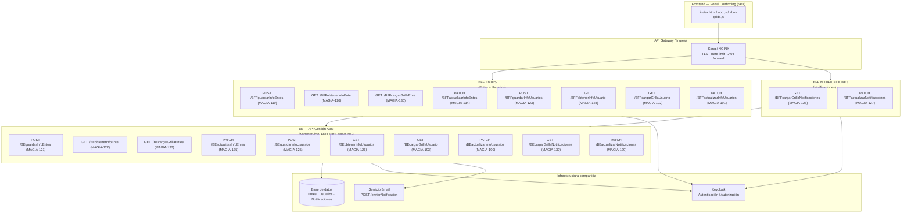

---

## 3. Diagrama de capas FE → BFF → BE

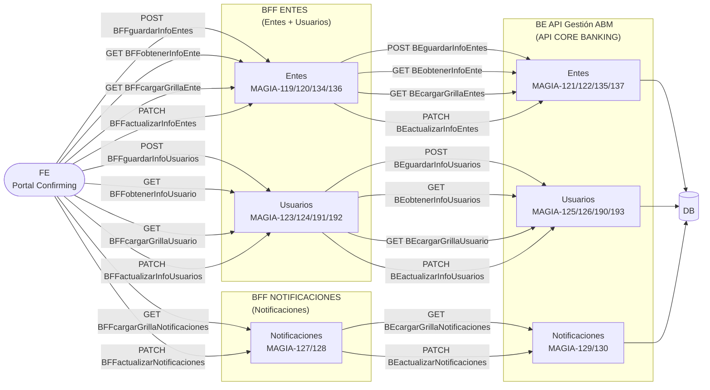

---

## 4. Diagramas de secuencia — Entes

### 4.1 POST /BFFguardarInfoEntes → /BEguardarInfoEntes (MAGIA-119 / MAGIA-121)

> Historia: "COMO plataforma Confirming QUIERO guardar los entes generados en la plataforma PARA que sean utilizables por los usuarios"

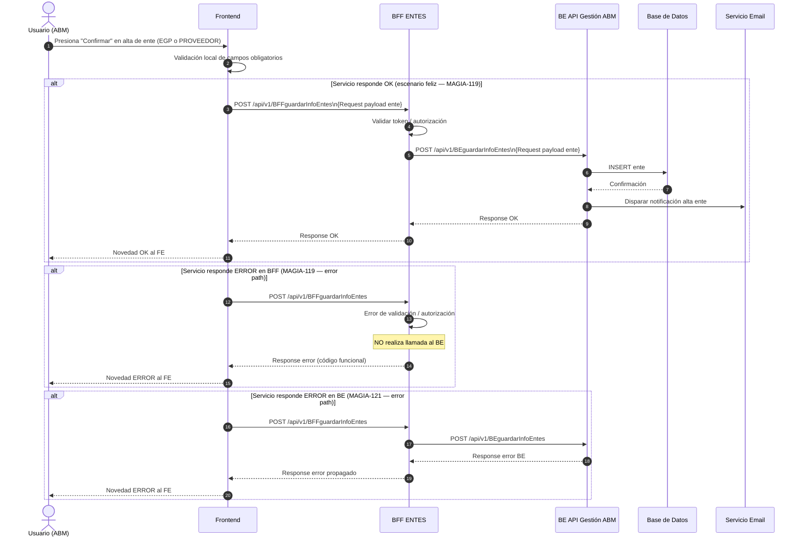

### 4.2 GET /BFFcargarGrillaEnte → /BEcargarGrillaEntes (MAGIA-136 / MAGIA-137)

> Historia: "COMO plataforma Confirming QUIERO los entes existentes en la plataforma PARA que sean visibles por los usuarios"

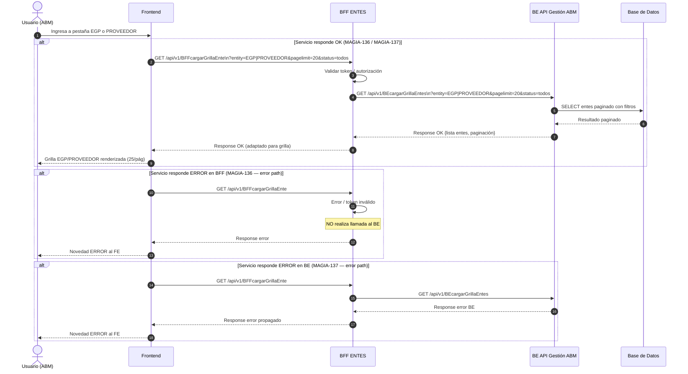

### 4.3 GET /BFFobtenerInfoEnte → /BEobtenerInfoEnte (MAGIA-120 / MAGIA-122)

> Historia: "COMO plataforma Confirming QUIERO ver la información del ente existente en la plataforma PARA que sean visibles por los usuarios"

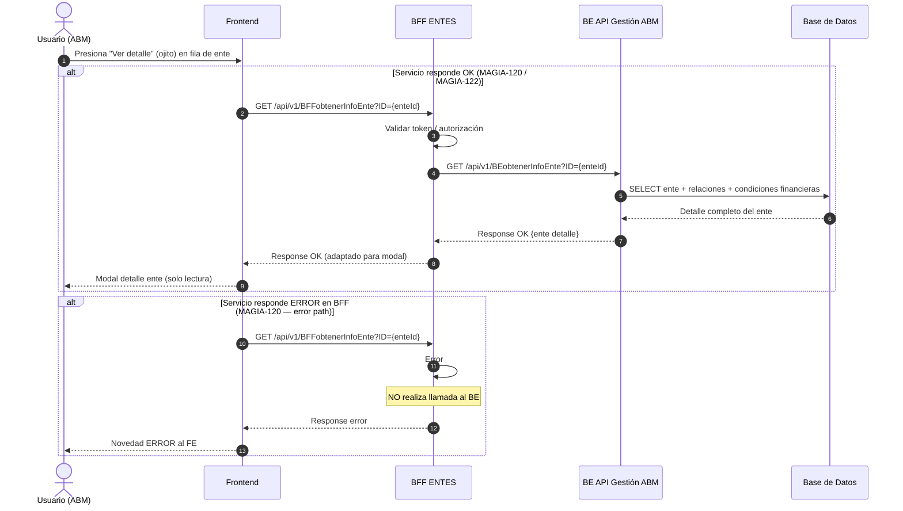

### 4.4 PATCH /BFFactualizarInfoEntes → /BEactualizarInfoEntes (MAGIA-134 / MAGIA-135)

> Historia: "QUIERO actualizar los entes generados en la plataforma PARA que sean utilizables por los usuarios en los flujos de **editar, bloquear, gestionar y borrar**"

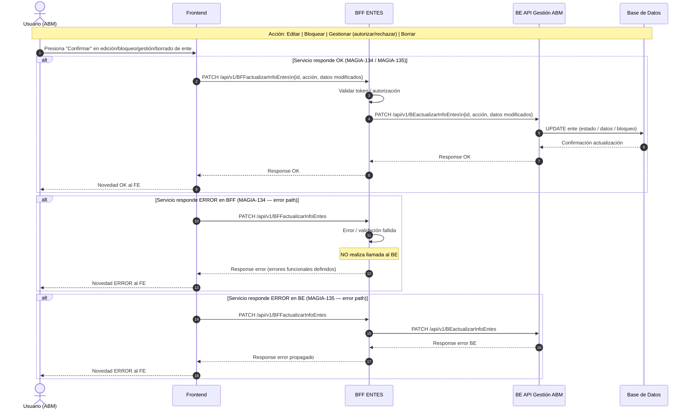

---

## 5. Diagramas de secuencia — Usuarios

### 5.1 POST /BFFguardarInfoUsuarios → /BEguardarInfoUsuarios (MAGIA-123 / MAGIA-125)

> Historia: "COMO plataforma Confirming QUIERO guardar los usuarios generados en la plataforma PARA que sean utilizables por los usuarios"

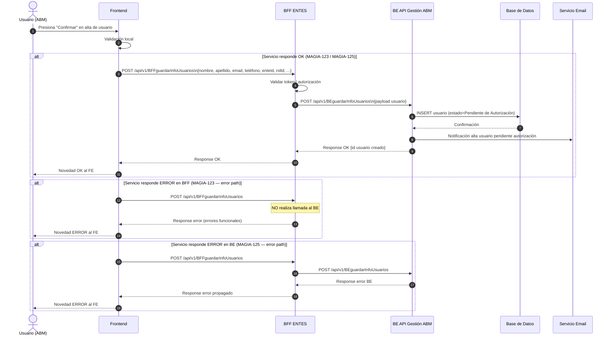

### 5.2 GET /BFFcargarGrillaUsuario → /BEcargarGrillaUsuario (MAGIA-192 / MAGIA-193)

> Historia: "COMO plataforma Confirming QUIERO los usuarios existentes en la plataforma PARA que sean visibles"

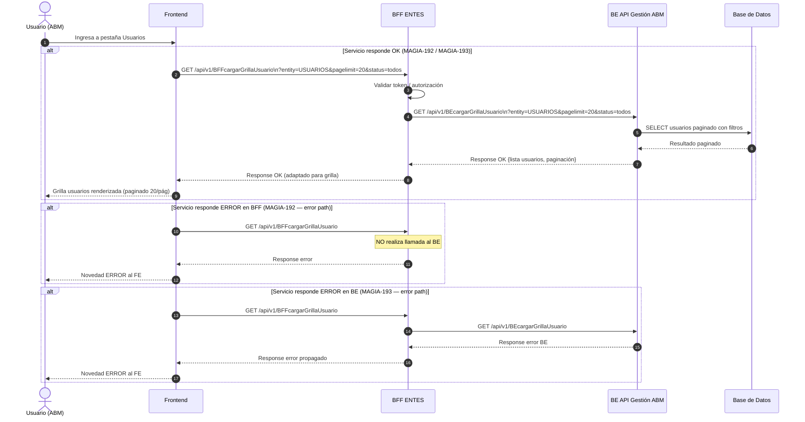

### 5.3 GET /BFFobtenerInfoUsuario → /BEobtenerInfoUsuarios (MAGIA-124 / MAGIA-126)

> Historia: "COMO plataforma Confirming QUIERO ver la información del usuario existente en la plataforma PARA que sean visibles por los usuarios"

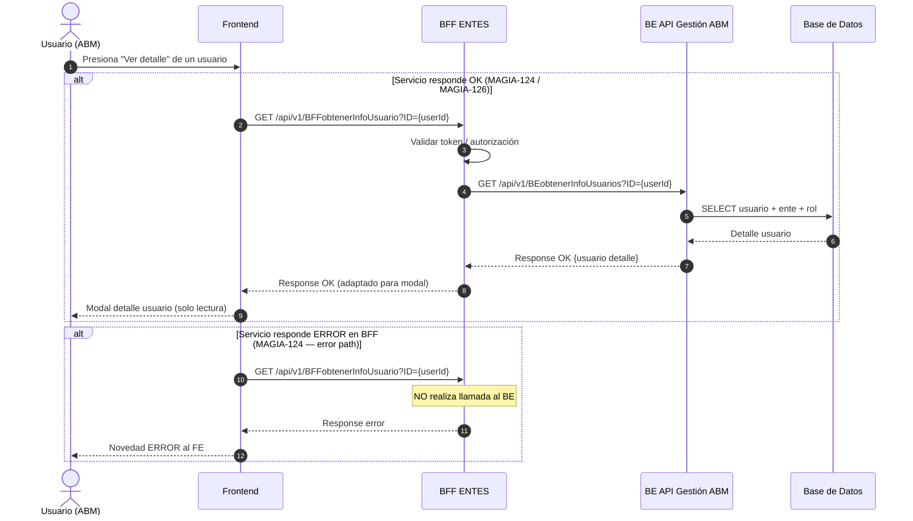

### 5.4 PATCH /BFFactualizarInfoUsuarios → /BEactualizarInfoUsuarios (MAGIA-191 / MAGIA-190)

> Historia: "QUIERO actualizar los usuarios generados en la plataforma" — flujos: **editar, gestionar, bloquear, borrar**

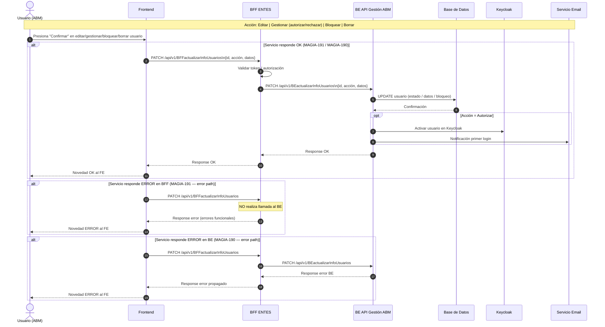

---

## 6. Diagramas de secuencia — Notificaciones

### 6.1 GET /BFFcargarGrillaNotificaciones → /BEcargarGrillaNotificaciones (MAGIA-128 / MAGIA-130)

> Historia: "COMO plataforma Confirming QUIERO las notificaciones existentes en la plataforma PARA que sean visibles por los usuarios"

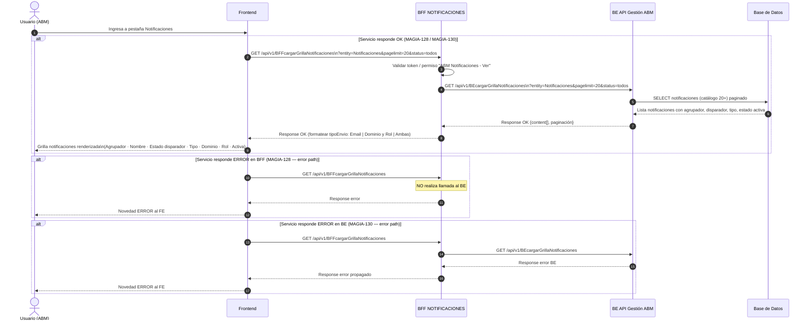

### 6.2 PATCH /BFFactualizarNotificaciones → /BEactualizarNotificaciones (MAGIA-127 / MAGIA-129)

> Historia: "COMO plataforma Confirming QUIERO actualizar las notificaciones generados en la plataforma PARA que sean utilizables por los usuarios en los flujos de **activar/inactivar**"

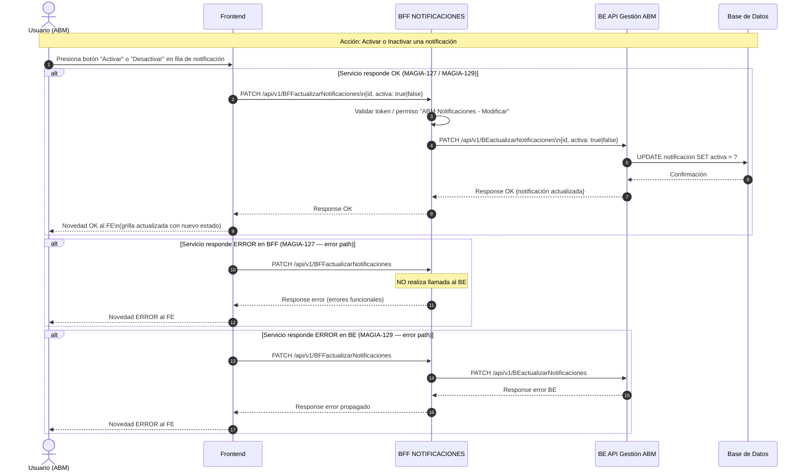

---

## 7. User Flow — Entes

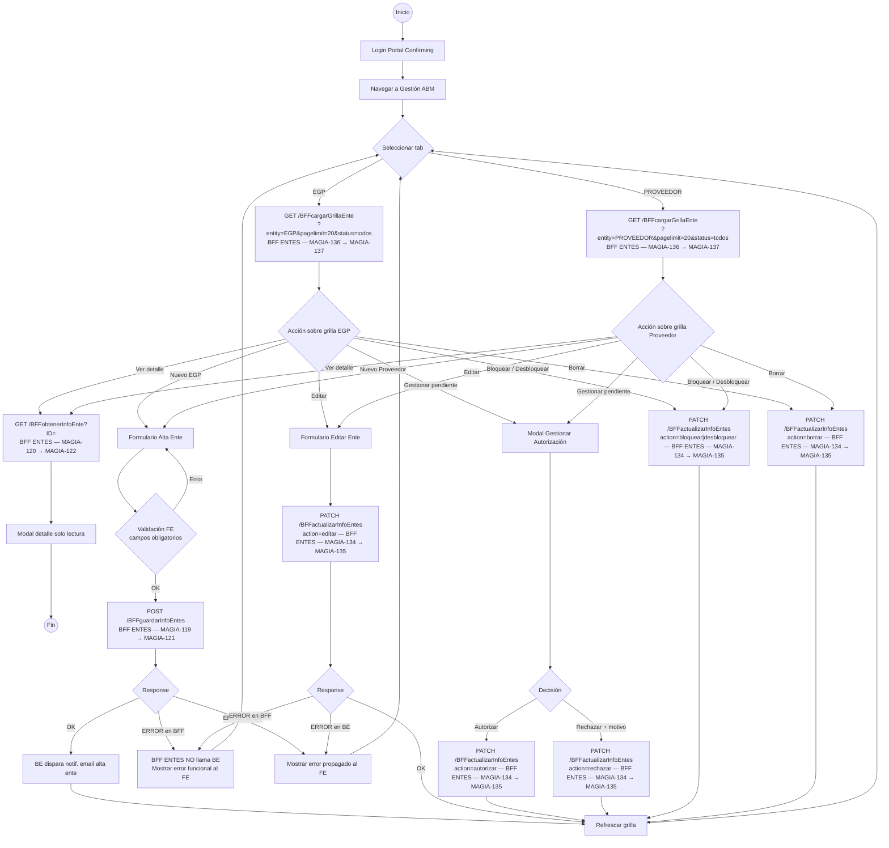

---

## 8. User Flow — Usuarios

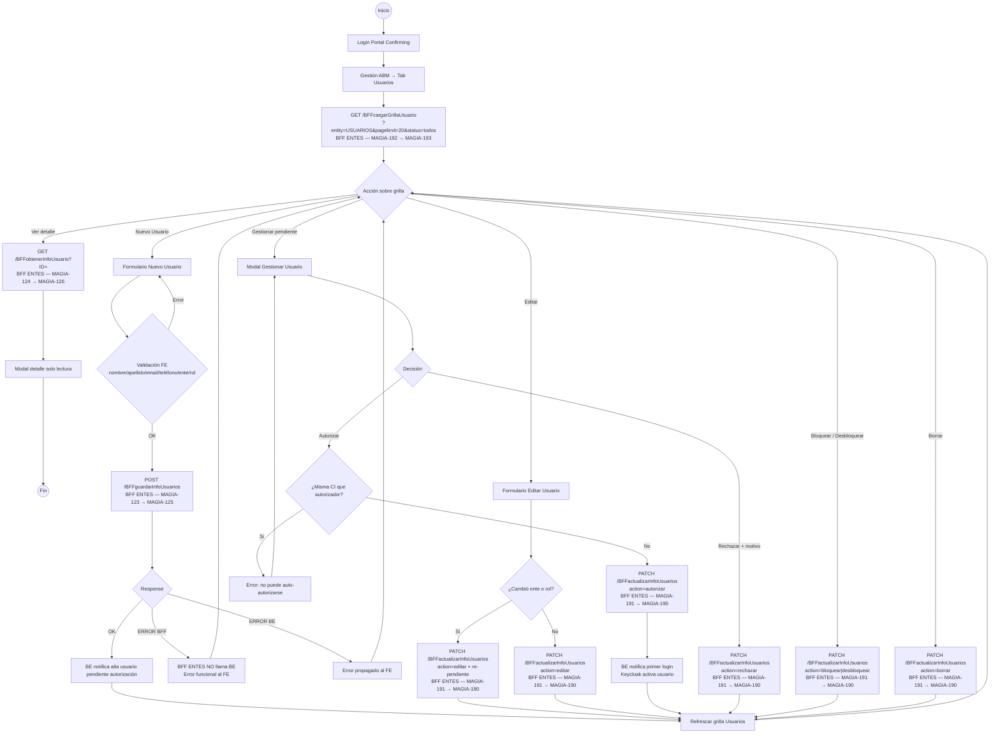

---

## 9. User Flow — Notificaciones

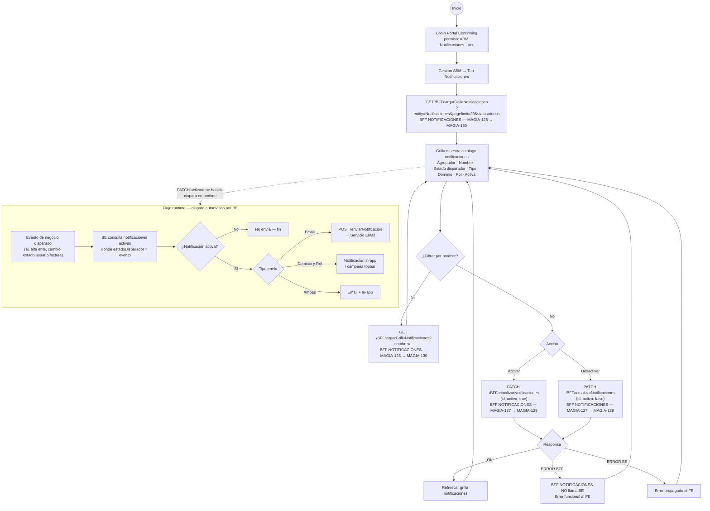

---

## 10. Modelo de datos

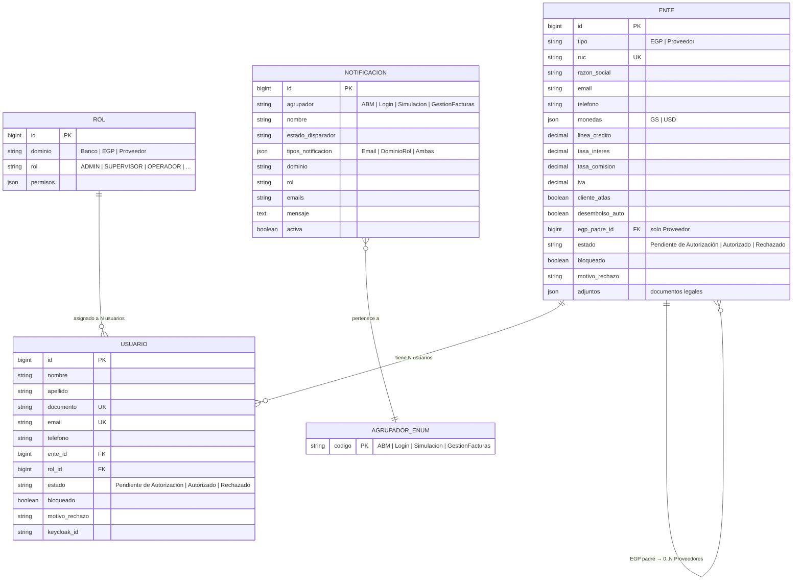

---

## 11. Matriz de trazabilidad Jira

| # | Dominio | BFF | Capa | Método | Endpoint (Jira) | Historia Jira | Estado |
|---|---------|-----|------|--------|-----------------|---------------|--------|
| 1 | Entes | BFF ENTES | BFF | POST | `/api/v1/BFFguardarInfoEntes` | MAGIA-119 | Relevamiento |
| 2 | Entes | BFF ENTES | BFF | GET | `/api/v1/BFFobtenerInfoEnte` | MAGIA-120 | Relevamiento |
| 3 | Entes | BFF ENTES | BFF | GET | `/api/v1/BFFcargarGrillaEnte` | MAGIA-136 | Relevamiento |
| 4 | Entes | BFF ENTES | BFF | PATCH | `/api/v1/BFFactualizarInfoEntes` | MAGIA-134 | Relevamiento |
| 5 | Entes | — | BE | POST | `/api/v1/BEguardarInfoEntes` | MAGIA-121 | Relevamiento |
| 6 | Entes | — | BE | GET | `/api/v1/BEobtenerInfoEnte` | MAGIA-122 | Relevamiento |
| 7 | Entes | — | BE | GET | `/api/v1/BEcargarGrillaEntes` | MAGIA-137 | Relevamiento |
| 8 | Entes | — | BE | PATCH | `/api/v1/BEactualizarInfoEntes` | MAGIA-135 | Relevamiento |
| 9 | Usuarios | BFF ENTES | BFF | POST | `/api/v1/BFFguardarInfoUsuarios` | MAGIA-123 | Relevamiento |
| 10 | Usuarios | BFF ENTES | BFF | GET | `/api/v1/BFFobtenerInfoUsuario` | MAGIA-124 | Relevamiento |
| 11 | Usuarios | BFF ENTES | BFF | GET | `/api/v1/BFFcargarGrillaUsuario` | MAGIA-192 | Relevamiento |
| 12 | Usuarios | BFF ENTES | BFF | PATCH | `/api/v1/BFFactualizarInfoUsuarios` | MAGIA-191 | Relevamiento |
| 13 | Usuarios | — | BE | POST | `/api/v1/BEguardarInfoUsuarios` | MAGIA-125 | Relevamiento |
| 14 | Usuarios | — | BE | GET | `/api/v1/BEobtenerInfoUsuarios` | MAGIA-126 | Relevamiento |
| 15 | Usuarios | — | BE | GET | `/api/v1/BEcargarGrillaUsuario` | MAGIA-193 | Relevamiento |
| 16 | Usuarios | — | BE | PATCH | `/api/v1/BEactualizarInfoUsuarios` | MAGIA-190 | Relevamiento |
| 17 | Notificaciones | BFF NOTIFICACIONES | BFF | GET | `/api/v1/BFFcargarGrillaNotificaciones` | MAGIA-128 | Relevamiento |
| 18 | Notificaciones | BFF NOTIFICACIONES | BFF | PATCH | `/api/v1/BFFactualizarNotificaciones` | MAGIA-127 | En Espera |
| 19 | Notificaciones | — | BE | GET | `/api/v1/BEcargarGrillaNotificaciones` | MAGIA-130 | Relevamiento |
| 20 | Notificaciones | — | BE | PATCH | `/api/v1/BEactualizarNotificaciones` | MAGIA-129 | En Espera |

---

### Criterios de aceptación comunes a todos los endpoints (fuente Jira)

> Extraídos de cada historia MAGIA — criterios idénticos aplicados a los 20 endpoints:

1. Que se exponga el EP correctamente (método correcto: POST / GET / PATCH)
2. Que se respeten los parámetros de request definidos
3. Que se respete el payload de response definido
4. Que se implementen los códigos de error
5. Que se llame al servicio de backend correctamente en el flujo OK
6. Que se envíe la novedad de error/ok al FE
7. **Regla cross-cutting:** cuando el servicio responde ERROR, el BFF **NO realiza llamada al BE**

---

*Documento generado desde historias Jira — Proyecto MAGIA — Banco Atlas*
*Fuente de verdad: https://bancoatlaspy.atlassian.net*
