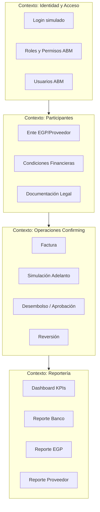
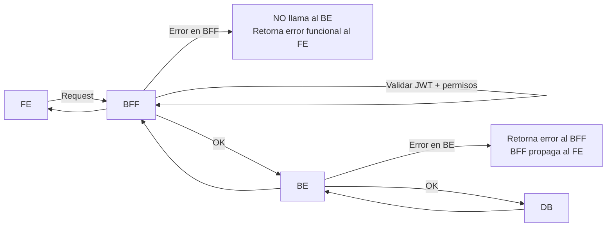
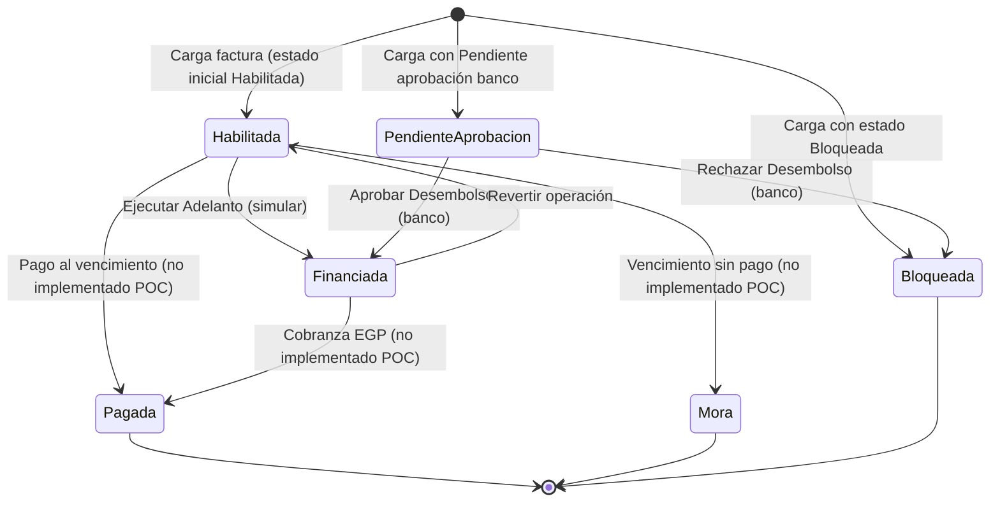
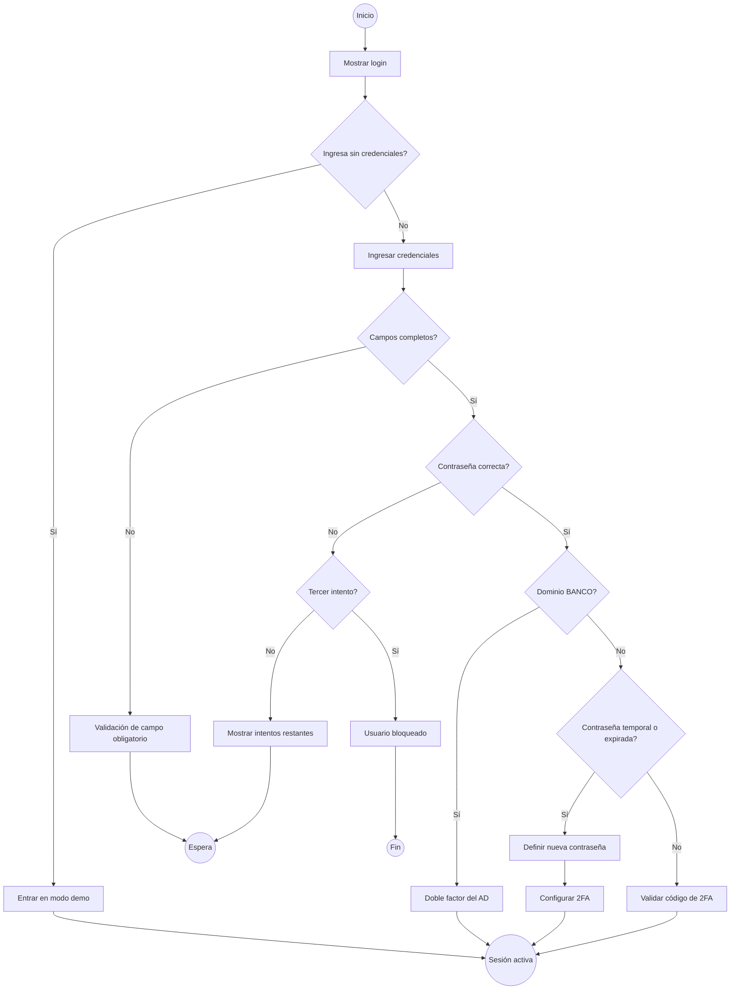
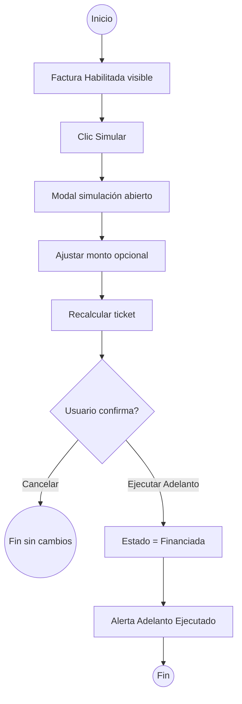
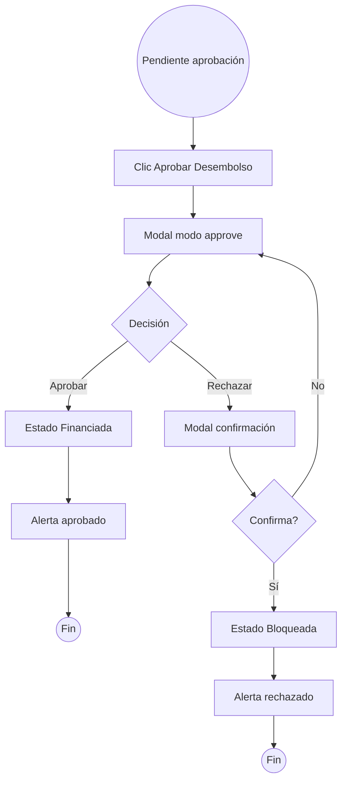

# Documento Funcional — Portal de Confirming Banco Atlas

| Campo | Valor |
|-------|-------|
| **Producto** | atlas-confirming-poc |
| **Versión del documento** | 2.0.0 |
| **Estado** | En Desarrollo — fuente de verdad: Jira proyecto MAGIA |
| **Fecha** | 2026-06-26 |
| **Audiencia** | Product Owner, Business Designer, UX, Desarrollo, QA, Operaciones Banco |
| **Fuente de verdad** | **Jira — https://bancoatlaspy.atlassian.net (proyecto MAGIA)** |
| **Metodologías de referencia** | User Story Mapping (Patton), Value Proposition Design (Osterwalder), Don't Make Me Think (Krug), Software Requirements (Wiegers & Beatty), Specification by Example (Adzic) |

> **IMPORTANTE:** A partir de la versión 2.0.0 la fuente de verdad del producto es **Jira (proyecto MAGIA)**. Este documento es una derivación del backlog de Jira y debe mantenerse sincronizado con él. Ante cualquier discrepancia, prevalece Jira.

---

## Tabla de contenidos

1. [Resumen ejecutivo y propuesta de valor](#1-resumen-ejecutivo-y-propuesta-de-valor)
2. [Alcance del producto](#2-alcance-del-producto)
3. [Actores, personas y jobs-to-be-done](#3-actores-personas-y-jobs-to-be-done)
4. [Glosario — Lenguaje ubicuo (DDD)](#4-glosario--lenguaje-ubicuo-ddd)
5. [Modelo de dominio y contextos delimitados](#5-modelo-de-dominio-y-contextos-delimitados)
6. [Arquitectura de información y navegación global](#6-arquitectura-de-información-y-navegación-global)
7. [Especificación funcional por módulo](#7-especificación-funcional-por-módulo)
8. [**API Gestión ABM — Contratos de integración (fuente: Jira MAGIA)**](#8-api-gestión-abm--contratos-de-integración-fuente-jira-magia)
9. [Máquina de estados — Ciclo de vida de la Factura](#9-máquina-de-estados--ciclo-de-vida-de-la-factura)
10. [Reglas de negocio y cálculos financieros](#10-reglas-de-negocio-y-cálculos-financieros)
11. [Matriz de permisos y roles](#11-matriz-de-permisos-y-roles)
12. [User Flows — Notación BPMN 2.0](#12-user-flows--notación-bpmn-20)
13. [Casos de uso](#13-casos-de-uso)
14. [User Stories — Criterios de aceptación en Gherkin](#14-user-stories--criterios-de-aceptación-en-gherkin)
15. [Prototipos Figma](#15-prototipos-figma)
16. [Limitaciones del POC y backlog sugerido](#16-limitaciones-del-poc-y-backlog-sugerido)
17. [Anexos](#17-anexos)

---

## 1. Resumen ejecutivo y propuesta de valor

### 1.1 Qué es el producto

**Portal de Confirming | Banco Atlas** es una aplicación web de demostración que simula el ciclo operativo de **Confirming** (adelanto de facturas a proveedores con respaldo de una Empresa Gran Pagador — EGP — y financiamiento del banco).

El portal permite a tres dominios de actores — **Banco**, **EGP** y **Proveedor** — visualizar métricas, gestionar entes participantes, cargar y operar facturas, simular adelantos, aprobar/rechazar desembolsos y consultar reportes segmentados por rol.

### 1.2 Propuesta de valor (Value Proposition Canvas)

| Segmento | Job (tarea a realizar) | Pain (dolor) | Gain (beneficio esperado) | Producto / alivio |
|----------|------------------------|--------------|---------------------------|-------------------|
| **Banco Atlas** | Supervisar operaciones de confirming, aprobar desembolsos, administrar entes | Procesos manuales, falta de visibilidad consolidada | Control centralizado, trazabilidad, reportes diarios | Dashboard, ABM, flujo de aprobación bancaria, reporte de desembolsos |
| **EGP** | Habilitar facturas de proveedores, solicitar adelantos dentro de línea de crédito | Demoras en pago a proveedores, gestión dispersa | Liquidez para proveedores sin afectar flujo propio | Carga de facturas, simulación, estados operativos, reporte de facturas propias |
| **Proveedor** | Cobrar antes del vencimiento de facturas aceptadas | Espera hasta fecha de pago EGP | Acreditación anticipada con costos transparentes | Simulación de adelanto, historial de operaciones acreditadas |

### 1.3 Objetivo del documento

Este documento funciona como **transferencia de conocimiento** entre negocio y equipo técnico. Detalla **cada pantalla, botón, campo, interacción, regla de negocio y transición de estado** implementada en el POC v1.0.0, de forma que cualquier lector pueda reproducir el comportamiento esperado sin inspeccionar el código.

---

## 2. Alcance del producto

### 2.1 Dentro del alcance (POC v1.0.0)

| Módulo | ID vista | Descripción |
|--------|----------|-------------|
| Autenticación | `login-view` | Login simulado (sin backend) |
| Dashboard | `dashboard-view` | KPIs estáticos + gráfico Chart.js |
| Confirming | `confirming-view` | Gestión de facturas, simulación, adelanto, aprobación, reversión |
| Gestión ABM | `abm-view` | Alta/edición de Entes, Usuarios y Roles |
| Reportes | `reports-view` | Tableros simulados por rol (Banco, EGP, Proveedor) |
| Modales transversales | Varios | Alertas, confirmaciones, formularios |

### 2.2 Fuera del alcance (POC)

- Autenticación real (OAuth, LDAP, MFA).
- Persistencia en base de datos o API REST.
- Integración con core bancario, tesorería o contabilidad.
- Notificaciones push/email reales.
- Escaneo QR real (simulado con timeout de 2 segundos).
- Edición de Usuarios y Roles existentes (solo muestra alerta de demo).
- Control de permisos por rol en runtime (usuario siempre opera como Administrador).
- Paginación, exportación CSV/PDF, auditoría de cambios.

---

## 3. Actores, personas y jobs-to-be-done

### 3.1 Actores del sistema

| Actor | Dominio | Descripción | Representación en POC |
|-------|---------|-------------|------------------------|
| **Administrador Banco** | Banco | Operador con acceso total al portal | Usuario demo `admin` / sesión "Administrador Atlas" |
| **Supervisor EGP** | EGP | Gestiona facturas y solicita adelantos de su empresa | Rol ABM demo "Supervisor" dominio EGP |
| **Operador Proveedor** | Proveedor | Consulta facturas y operaciones propias | Rol ABM demo "Operador" dominio Proveedor |
| **Sistema** | — | Cálculos automáticos, validaciones, transiciones | Lógica en `app.js` |

### 3.2 Personas de referencia

**Persona 1 — María (Administradora Banco Atlas)**  
- Rol: ADMIN Banco.  
- Objetivo: Aprobar desembolsos pendientes, revertir operaciones erróneas, mantener catálogo de entes.  
- Frecuencia: Diaria.

**Persona 2 — Carlos (Finanzas EGP — Tigo Paraguay)**  
- Rol: Supervisor EGP.  
- Objetivo: Cargar facturas de proveedores, simular adelantos, monitorear mora.  
- Frecuencia: Semanal.

**Persona 3 — Laura (Tesorería Proveedor — Tech Solutions)**  
- Rol: Operador Proveedor.  
- Objetivo: Ver historial de acreditaciones y montos netos recibidos.  
- Frecuencia: Quincenal.

### 3.3 User Story Map (visión de backbone)

```
ACTIVIDADES DEL USUARIO (backbone horizontal)
├── Acceder al portal
├── Seleccionar contexto de operación (ente)
├── Monitorear indicadores
├── Gestionar participantes (ABM)
├── Operar facturas (cargar → simular → ejecutar/aprobar)
├── Revertir / rechazar operaciones
└── Consultar reportes por rol

TAREAS (segunda fila)
├── Login / Logout
├── Selector ente topbar
├── KPIs + gráfico
├── Tabs Entes / Usuarios / Roles
├── Filtros + tabla facturas
├── Modal simulación / aprobación
└── Tabs Vista Banco / EGP / Proveedor

DETALLE (tercera fila — historias en sección 13)
```

---

## 4. Glosario — Lenguaje ubicuo (DDD)

> **Principio DDD:** PO y Desarrollador deben usar los mismos términos. Las entidades del código (`participants`, `invoices`, `abmUsers`) se mapean aquí al lenguaje de negocio.

| Término (Ubiquitous Language) | Definición de negocio | Entidad / campo en POC | Sinónimos a evitar |
|-------------------------------|----------------------|------------------------|-------------------|
| **Confirming** | Producto financiero donde el banco adelanta al proveedor el importe de una factura aceptada por la EGP | Módulo `confirming-view` | Factoring genérico |
| **Ente** | Participante registrado: EGP o Proveedor | `participants[]` | Cliente, empresa (ambiguo) |
| **EGP** | Empresa Gran Pagador; emite órdenes de pago y respalda facturas | `tipo: 'EGP'` | Pagador, deudor |
| **Proveedor** | Empresa acreedora de la factura; beneficiario del adelanto | `tipo: 'Proveedor'` | Vendor, supplier (en UI usar Proveedor) |
| **Factura** | Documento comercial con monto, fechas y partes; unidad operativa del confirming | `invoices[]` | Invoice (solo en código) |
| **Adelanto** | Desembolso anticipado al proveedor descontando intereses, comisión e IVA | Acción "Ejecutar Adelanto" | Préstamo, crédito |
| **Simulación** | Cálculo previo sin impacto en estado | Modal `simulate-modal` modo `simulate` | Cotización (aceptable) |
| **Desembolso** | Ejecución efectiva del adelanto; requiere aprobación bancaria si estado es "Pendiente aprobación banco" | Transición a `Financiada` | Pago, transferencia |
| **Estado de Factura** | Ciclo de vida operativo de la factura | Campo `estado` | Status |
| **Habilitada** | Factura apta para simular y adelantar | `estado: 'Habilitada'` | Activa, disponible |
| **Financiada** | Adelanto ejecutado; factura en cartera financiada | `estado: 'Financiada'` | Financiado |
| **Pagada** | Factura saldada al vencimiento (cierre) | `estado: 'Pagada'` | Cerrada (parcialmente) |
| **Mora** | Factura vencida sin pago | `estado: 'Mora'` | Atraso, default |
| **Bloqueada** | Factura no operable; rechazo bancario u operativo | `estado: 'Bloqueada'` | Inactiva |
| **Pendiente aprobación banco** | Solicitud de desembolso esperando decisión del banco | `estado: 'Pendiente aprobación banco'` | En revisión |
| **Línea de Crédito** | Cupo máximo GS asignado a un EGP | `lineaCredito` | Límite, cupo |
| **TNA** | Tasa Nominal Anual para intereses del adelanto | `tasaInteres` | Tasa, rate |
| **Comisión operativa** | Porcentaje sobre monto adelantado | `tasaComision` | Fee |
| **Monto Neto a Acreditar** | Monto final al proveedor post descuentos | Resultado de simulación `neto` | Líquido, neto |
| **Ente operativo** | Contexto seleccionado en topbar para filtrar operaciones | `operating-entity-select` | Empresa activa |
| **ABM** | Alta, Baja, Modificación de registros maestros | `abm-view` | CRUD (técnico) |
| **Rol / Dominio** | Conjunto de permisos acotado por tipo de actor | `abmRoles[]` | Perfil (aceptable en UI) |
| **Cliente Atlas** | Ente con cuenta activa en Banco Atlas | `clienteAtlas: boolean` | Cliente bancario |
| **Desembolso Automático** | Flag de configuración para flujo sin intervención manual | `desembolsoAuto: boolean` | Auto-pago |

---

## 5. Modelo de dominio y contextos delimitados

### 5.1 Bounded Contexts



### 5.2 Agregados principales

**Agregado Factura** (`invoices`)  
- Identificador: `id` (número de factura, ej. `001-001-0001234`).  
- Atributos: `egp`, `prov`, `emision`, `vto`, `moneda`, `monto`, `estado`.  
- Invariante: `monto > 0`; `vto >= emision` (no validado en POC — backlog).

**Agregado Ente** (`participants`)  
- Identificador: `id` numérico autoincremental.  
- Raíz de condiciones financieras por EGP.

**Agregado Usuario Portal** (`abmUsers`)  
- Vinculado a un `enteId`.

**Agregado Rol** (`abmRoles`)  
- `dominio` + `rol` + lista `permisos`.

---

## 6. Arquitectura de información y navegación global

### 6.1 Estructura de vistas

La aplicación alterna entre dos contenedores principales:

| Vista contenedora | ID | Visible cuando |
|-------------------|-----|----------------|
| Login y flujos de acceso | `login-view` | Usuario no autenticado (inicio). Contiene las pantallas `.auth-step` de la épica LOGIN |
| Aplicación | `app-view` | Al completar un flujo de acceso o al ingresar sin credenciales |

Dentro de `app-view`, el layout es **Sidebar + Topbar + Content Wrapper**.

### 6.2 Sidebar — Navegación principal

| Orden | Etiqueta UI | Icono | `data-target` | Título topbar (`data-page-title`) |
|-------|-------------|-------|---------------|-----------------------------------|
| 1 | Dashboard | `ph-squares-four` | `dashboard-view` | Dashboard General |
| 2 | Confirming | `ph-arrows-left-right` | `confirming-view` | Confirming |
| 3 | Gestión (ABM) | `ph-users-three` | `abm-view` | Gestión (ABM) |
| 4 | Reportes | `ph-chart-bar` | `reports-view` | Reportes |

**Comportamiento al hacer clic en ítem de navegación:**

1. Se previene navegación default (`preventDefault`).
2. Se remueve clase `active` de todos los `.nav-item[data-target]`.
3. Se agrega `active` al ítem clickeado.
4. Se oculta todas las `.page-view` y se muestra la target.
5. Se actualiza `#page-title` con `data-page-title`.
6. Se cierra sidebar móvil (`sidebar-mobile-open` removido de `#app-view`).
7. Si target es `dashboard-view` → reinicializa gráfico Chart.js.
8. Si target es `abm-view` → refresca tablas Entes, Usuarios, Roles.

**Footer sidebar (acciones secundarias):**

| Elemento | Acción al clic | Resultado |
|----------|----------------|-----------|
| Centro de Ayuda | `showCustomAlert(...)` | Modal aviso: "Centro de ayuda: contenido de demostración." |
| Perfil de Usuario | `showCustomAlert(...)` | Modal aviso: "Perfil de usuario: vista de demostración." |
| Cerrar Sesión | `#logout-btn` click | `authLogout('MANUAL')`: oculta `app-view`, muestra `login-view` y reinicia el flujo de acceso |

### 6.3 Topbar — Elementos globales

| Elemento | ID / selector | Interacción paso a paso |
|----------|---------------|-------------------------|
| **Menú hamburguesa** | `#toggle-sidebar` | 1. Clic en botón. 2. Toggle clase `sidebar-mobile-open` en `#app-view`. 3. En viewport móvil, sidebar se superpone. |
| **Título de página** | `#page-title` | Solo lectura; cambia con navegación sidebar. |
| **Selector ente operativo** | `#operating-entity-select` | 1. Desplegar lista. 2. Opción default: "Todos los entes". 3. Opciones: cada ente `{razon} ({tipo})` ordenado alfabéticamente. 4. Al cambiar (`change` event): ejecuta `refreshConfirmingView()` → actualiza panel ente + tabla facturas filtrada. |
| **Notificaciones** | Botón campana | Clic → alerta "Sin notificaciones nuevas en esta demostración." |
| **Avatar / usuario** | `.user-profile` | Display estático: "Administrador Atlas", rol "Acceso total · Confirming", iniciales "AD". Sin interacción. |

### 6.4 Modales transversales

| Modal | ID | Apertura | Cierre |
|-------|-----|----------|--------|
| Alerta | `alert-modal` | `showCustomAlert(msg, title)` | Botón Aceptar, X |
| Confirmación | `confirm-modal` | `showCustomConfirm(msg, callback, title)` | Cancelar, Aceptar (ejecuta callback) |
| Cargar factura | `new-invoice-modal` | Botón "Cargar Factura" | Cancelar, X, post-guardado |
| Simulación/Aprobación | `simulate-modal` | Simular / Aprobar Desembolso | Cancelar, acciones footer |
| ABM Ente | `abm-modal` | Nuevo/Editar ente | Cancelar, Guardar |
| ABM Usuario | `user-modal` | Nuevo Usuario | Cancelar, Guardar |
| ABM Rol | `role-modal` | Nuevo Rol | Cancelar, Guardar |

**Regla UI:** Modales usan clase `active` en contenedor `.modal` para mostrarse.

---

## 7. Especificación funcional por módulo

---

### 7.1 Módulo: Autenticación (Login)

**Vista:** `#login-view` · **Lógica:** `auth.js`  
**Estado inicial:** Activa al cargar la aplicación.

> Las historias de esta épica están especificadas en `assets/historias-usuario-login_v1.0.0.md`
> (criterios de aceptación en Gherkin) y el recorrido de las pantallas en
> `assets/poc-pantallas-login.md`. Todo el comportamiento es **simulado en el front end**: no hay
> Keycloak, AD, Home Banking ni envío real de correos.

#### 7.1.1 Layout

- Logo Banco Atlas (`assets/logo-banco-atlas.png`).
- Título y subtítulo dinámicos según la pantalla del flujo (`#auth-step-title` / `#auth-step-subtitle`).
- Una sección `.auth-step` por pantalla; solo la que tiene la clase `active` se muestra.
- Panel de POC "Escenarios de login" (`#auth-demo`) para cambiar perfil, estado de la credencial y
  tiempo de inactividad, y para saltar a cualquier pantalla.

#### 7.1.2 Pantallas del flujo

| `data-step` | Historia | Contenido |
|-------------|----------|-----------|
| `login` | LO-25 | Usuario, contraseña, "¿Olvidaste tu contraseña?" e ingreso sin credenciales |
| `2fa-ad` | LO-07 | Doble factor gestionado por el AD (usuarios BANCO) |
| `primer-login-temporal` | LO-10 | Aviso de contraseña temporal de un solo uso |
| `canal-password` | LO-10 / LO-31 | Elección entre Home Banking y contraseña propia |
| `derivacion-homebanking` | LO-10 / LO-31 | Derivación informativa a Home Banking |
| `nueva-password` | LO-10 / LO-13 | Creación de contraseña con checklist de política en vivo |
| `2fa-mail` | LO-22 | Confirmación (o cambio) del correo que recibe el código |
| `2fa-otp` | LO-22 / LO-27 | Ingreso del código de 6 dígitos, vigencia, reenvío y dispositivo confiable |
| `2fa-listo` | LO-22 | Cierre de la configuración de 2FA |
| `olvide-password` | LO-30 / LO-31 / LO-32 | Ingreso del usuario para recuperar el acceso |
| `aviso-ad` | LO-30 | Aviso de que la contraseña se administra en el AD |
| `usuario-bloqueado` | LO-34 | Bloqueo por 3 intentos fallidos |
| `password-actualizada` | LO-32 / LO-33 | Confirmación del cambio de contraseña |

#### 7.1.3 Campos del formulario de login

| Campo | ID | Tipo | Obligatorio | Placeholder |
|-------|-----|------|-----------|-------------|
| Usuario | `#username` | text | Sí (validado en JS) | "Ingrese su usuario" |
| Contraseña | `#password` | password | Sí (validado en JS) | "••••••••" |

El usuario se precarga con el del perfil elegido en el panel de escenarios; la contraseña esperada la
indica ese mismo panel. Cualquier otra contraseña dispara el flujo de intentos fallidos.

#### 7.1.4 Botón "Ingresar al Portal"

**Flujo paso a paso:**

1. `auth.js` intercepta el submit y valida que usuario y contraseña estén completos.
2. Si la contraseña no coincide con la del escenario, incrementa el contador de intentos y muestra
   los restantes; al tercer intento lleva a la pantalla de usuario bloqueado.
3. Con la contraseña correcta deriva según el perfil y el estado de la credencial:
   - BANCO → doble factor del AD.
   - EGP / Proveedor con contraseña temporal → aviso de contraseña temporal.
   - EGP / Proveedor con contraseña expirada → flujo de cambio de contraseña.
   - Login recurrente → envío y validación del código de 2FA.
4. Al completar el flujo se invoca `enterPlatformSession(username)`, que oculta `#login-view`,
   muestra `#app-view` e inicializa dashboard, confirming, ABM y selectores.

#### 7.1.5 Ingreso sin credenciales (modo demo)

El botón "Ingresar sin credenciales (modo demo)" invoca `enterPlatformSession(username, { sinCredenciales: true })`
y entra directo a la plataforma. Mientras la sesión sea de este tipo, la topbar muestra el chip
"Modo demo sin login". Esta opción se mantiene siempre disponible para poder probar la plataforma
mientras el login no está integrado.

#### 7.1.6 Cierre de sesión (LO-29 y RN-06)

- **Manual:** `#logout-btn` invoca `authLogout('MANUAL')`, que vuelve al login y descarta el estado
  del flujo (en el próximo ingreso se vuelve a pedir el 2FA).
- **Por inactividad:** al entrar a la plataforma arranca el vigía de inactividad (5 minutos por
  defecto, configurable a 30 o 10 segundos para capturas). Un minuto antes del cierre se abre
  `#session-timeout-modal` con cuenta regresiva: "Continuar conectado" renueva la sesión y la falta de
  respuesta cierra la sesión con el mensaje correspondiente.

**Criterio UX (Krug):** una sola acción principal evidente por pantalla; el estado del flujo se
comunica con el indicador de pasos (contraseña → verificación → listo).

---

### 7.2 Módulo: Dashboard

**Vista:** `#dashboard-view`  
**Acceso:** Sidebar → Dashboard.

#### 7.2.1 Sección "Métricas Principales"

**Encabezado:** Título h3 + botón secundario.

| Botón | Clase | Acción |
|-------|-------|--------|
| **Agregar Métrica** | `btn-secondary btn-sm` | Clic → alerta "Funcionalidad en construcción: Agregar nuevo gráfico o métrica." |

#### 7.2.2 KPI Cards (datos estáticos — no conectados a `invoices`)

| KPI | Valor mostrado | Tendencia | Icono |
|-----|----------------|-----------|-------|
| Adelantos Generados | Gs. 15.4B | +12% este mes (positivo) | `ph-money` |
| Transacciones | 1,248 | +5% este mes | `ph-receipt` |
| Facturas en Mora | 32 | -2% este mes (negativo) | `ph-warning-circle` |
| Rentabilidad | 4.2% | Estable | `ph-chart-line-up` |

> **Nota de negocio:** En producción estos KPIs deben calcularse desde el agregado de operaciones. En POC son decorativos.

#### 7.2.3 Gráfico "Evolución de Adelantos y Cobranzas"

- **Canvas:** `#mainChart`.
- **Librería:** Chart.js, tipo `bar`.
- **Eje X:** Meses Ene–Jun.
- **Series:**
  - Adelantos Generados (Millones): color `#901d2d`.
  - Cobranzas a Término (Millones): color `#4D4D4D`.
- **Comportamiento:** Se destruye instancia previa al re-ingresar al dashboard para evitar duplicados.

---

### 7.3 Módulo: Confirming (CORE)

**Vista:** `#confirming-view`  
**Propósito:** Corazón operativo del producto — gestión y operación de facturas.

#### 7.3.1 Panel de información del Ente seleccionado

**Contenedor:** `#entity-info-panel`  
**Visibilidad:** Oculto (`hidden`) cuando selector topbar = "Todos los entes". Visible cuando hay un ente específico seleccionado.

| Campo UI | ID elemento | Fuente de datos |
|----------|-------------|-----------------|
| Nombre ente | `#entity-info-name` | `ente.razon` |
| Badge tipo | `#entity-info-tipo` | `ente.tipo` (EGP / Proveedor) |
| RUC | `#entity-info-ruc` | `ente.ruc` |
| Línea de Crédito | `#entity-info-linea` | Formateada GS si `lineaCredito > 0`, sino "—" |
| TNA | `#entity-info-tna` | `{tasaInteres}%` |
| Comisión | `#entity-info-comision` | `{tasaComision}%` |
| IVA | `#entity-info-iva` | `{iva}%` |
| Monedas | `#entity-info-monedas` | Badges GS / USD |

**Actualización:** Automática al cambiar `#operating-entity-select` o tras guardar ente en ABM.

#### 7.3.2 Barra de filtros y acciones

| Control | ID | Comportamiento detallado |
|---------|-----|--------------------------|
| **Buscar** | `#search-invoice` | Evento `input`. Filtra facturas donde query coincide con: número factura (includes), EGP (case insensitive includes), Proveedor (case insensitive includes). Se combina con filtro estado Y filtro ente topbar. |
| **Estado** | `#filter-status` | Evento `change`. Opciones: Todos, Habilitada, Financiada, Pagada, Mora, Bloqueada, Pendiente aprobación banco. |
| **Cargar Factura** | `#btn-cargar-factura-confirming` | Clic → `openModal('new-invoice-modal')`. |

**Lógica de filtro por ente (topbar):**

- Si no hay ente seleccionado → muestra todas las facturas (sujeto a búsqueda/estado).
- Si hay ente seleccionado con razón social `R`:
  - Muestra factura si `inv.egp === R` **OR** `inv.prov === R`.

#### 7.3.3 Tabla de facturas

**Cuerpo:** `#invoices-tbody` — renderizado dinámico.

| Columna | Contenido |
|---------|-----------|
| Nro. Factura | `inv.id` bold |
| EGP (Empresa) | `inv.egp` |
| Proveedor | `inv.prov` |
| Emisión | `inv.emision` (ISO date) |
| Vencimiento | `inv.vto` |
| Monto | `formatCurrency(monto, moneda)` |
| Estado | Badge con clase según estado |
| Acciones | Botones condicionados por estado (ver 7.3.4) |

**Estado vacío:** Mensaje "No se encontraron facturas con los filtros aplicados." colspan 8.

**Badges de estado — clases CSS:**

| Estado | Clase badge |
|--------|-------------|
| Habilitada | `status-habilitada` |
| Financiada | `status-financiada` |
| Pagada | `status-pagada` |
| Mora | `status-mora` |
| Bloqueada | `status-bloqueada` |
| Pendiente aprobación banco | `status-pendiente-aprobacion-banco` |

#### 7.3.4 Acciones por fila según estado

| Estado factura | Control UI | ID función | Flujo |
|----------------|------------|------------|-------|
| **Habilitada** | Botón "Simular" (`btn-primary btn-sm`) | `openSimulation(id)` | Abre modal simulación modo `simulate` |
| **Financiada** | Botón "Revertir" (`btn-secondary btn-sm text-danger`) | `revertInvoice(id)` | Confirmación → estado vuelve a Habilitada |
| **Bloqueada** | Texto "No operable" + icono candado | — | Sin acción |
| **Pendiente aprobación banco** | Botón "Aprobar Desembolso" | `openApproval(id)` | Abre modal modo `approve` |
| **Pagada** | — | — | Sin botones |
| **Mora** | — | — | Sin botones en POC |

---

#### 7.3.5 Modal: Cargar Nueva Factura

**ID:** `new-invoice-modal`

##### Header

| Control | Acción |
|---------|--------|
| **Escanear Factura** (icono scan) | `simulateScan()` — ver 7.3.6 |
| **Cerrar (X)** | `closeModal('new-invoice-modal')` |

##### Formulario `#new-invoice-form`

| Campo | ID | Tipo | Obligatorio | Opciones / notas |
|-------|-----|------|-------------|------------------|
| Nro. Factura | `#ni-nro` | text | Sí | Ej: 001-001-0001234 |
| Empresa (EGP) | `#ni-egp` | select | Sí | Retail S.A., Tigo Paraguay, Cervepar |
| Proveedor | `#ni-prov` | select | Sí | Tech Solutions S.A., Logistica Integral, Limpieza Total SRL |
| Fecha Emisión | `#ni-emision` | date | Sí | — |
| Fecha Vencimiento | `#ni-vto` | date | Sí | — |
| Moneda | `#ni-moneda` | select | No (default GS) | GS, USD |
| Monto | `#ni-monto` | number | Sí | — |
| Estado Inicial | `#ni-estado` | select | No | Habilitada, Bloqueada, Pendiente aprobación banco |

##### Footer

| Botón | Acción |
|-------|--------|
| **Cancelar** | Cierra modal sin guardar |
| **Guardar Factura** | `submitNewInvoice()` |

**Flujo Guardar Factura (`submitNewInvoice`):**

1. Lee todos los campos.
2. Valida: `nro`, `emision`, `vto`, `monto` presentes. Si falta → alerta "Por favor complete todos los campos obligatorios."
3. Crea objeto factura y lo inserta al **inicio** del array `invoices` (`unshift`).
4. Cierra modal.
5. Resetea formulario.
6. Refresca tabla (`renderInvoices()` sin perder filtros actuales — **nota:** implementación actual llama `renderInvoices()` sin args, resetea filtros visualmente pero mantiene valores en inputs).
7. Alerta éxito: "La factura ha sido registrada exitosamente."

---

#### 7.3.6 Simulación de escaneo QR (demo)

**Función:** `simulateScan()`

**Pasos visibles para el usuario:**

1. Clic en icono escanear en header del modal factura.
2. Aparece overlay `#scanner-overlay` con animación línea + icono QR + texto "Escaneando documento...".
3. Tras **2000 ms**, overlay se oculta.
4. Campos autocompletados:
   - Nro: `001-002-` + 7 dígitos aleatorios.
   - EGP: Retail S.A.
   - Proveedor: Logistica Integral.
   - Emisión: fecha hoy.
   - Vencimiento: hoy + 45 días.
   - Moneda: GS.
   - Monto: aleatorio entre 10.000.000 y 60.000.000.
5. Alerta: "Factura leída correctamente desde código QR."

---

#### 7.3.7 Modal: Simulación de Adelanto / Aprobación de Desembolso

**ID:** `simulate-modal`  
**Modos:** `simulate` | `approve` (variable `currentSimulationMode`).

##### Apertura — modo Simular (`openSimulation` → `openAdvanceModal(id, 'simulate')`)

**Precondición:** Factura en estado **Habilitada**.

**Pasos:**

1. Sistema localiza factura por ID.
2. Busca configuración EGP en `participants` (`razon === inv.egp && tipo === 'EGP'`).
3. Determina si EGP es multimoneda (`monedas.length > 1`).
4. Configura UI:
   - Título: "Simulación de Adelanto".
   - Sección: "Datos a adelantar".
   - Label monto: "Monto a adelantar".
   - Moneda: editable solo si multimoneda; si no, disabled.
   - Monto: editable, `max = inv.monto`.
   - Botones visibles: **Cancelar**, **Ejecutar Adelanto**. Ocultos: Aprobar, Rechazar.
5. Setea monto inicial = monto factura.
6. Ejecuta `recalculateSimulation()`.
7. Abre modal.

##### Apertura — modo Aprobar (`openApproval` → `openAdvanceModal(id, 'approve')`)

**Precondición:** Factura en estado **Pendiente aprobación banco**.

**Diferencias vs simular:**

- Título: "Aprobación de Desembolso".
- Sección: "Datos del adelanto a aprobar".
- Label monto: "Monto solicitado".
- Moneda y monto **bloqueados** (readonly/disabled).
- Botones visibles: **Cancelar**, **Rechazar**, **Aprobar**. Oculto: Ejecutar Adelanto.

##### Ticket de simulación (`#simulation-ticket`)

Recalculado en cada cambio de monto/moneda (`recalculateSimulation`).

| Línea ticket | Descripción |
|--------------|-------------|
| Factura original | ID + EGP – Proveedor |
| Días a adelantar | Días desde hoy hasta vencimiento (mín 0) |
| Intereses a descontar | Monto negativo, TNA del EGP |
| Comisiones operativas | Monto negativo, % comisión EGP |
| I.V.A. | Monto negativo, % IVA sobre (interés + comisión) |
| **Monto Neto a Acreditar** | Fila total destacada |

##### Footer — acciones

| Botón | ID | Modo | Flujo paso a paso |
|-------|-----|------|-------------------|
| **Cancelar** | — | Ambos | Cierra modal sin cambios |
| **Ejecutar Adelanto** | `#btn-execute-adelanto` | simulate | 1. Cambia factura a **Financiada**. 2. Refresca tabla. 3. Cierra modal. 4. Limpia contexto simulación. 5. Alerta: "La operación ha sido confirmada. El monto neto será acreditado según los plazos establecidos." |
| **Aprobar** | `#btn-approve-adelanto` | approve | 1. Cambia factura a **Financiada**. 2. Cierra modal. 3. `refreshConfirmingView()`. 4. Alerta desembolso aprobado con número factura. |
| **Rechazar** | `#btn-reject-adelanto` | approve | 1. Muestra confirmación con detalle factura y monto. 2. Si usuario confirma: estado → **Bloqueada**. 3. Cierra modal. 4. Alerta rechazo. |

---

#### 7.3.8 Reversión de adelanto

**Función:** `revertInvoice(invoiceId)`  
**Precondición:** Estado **Financiada**.

**Flujo:**

1. Usuario clic en "Revertir" en fila.
2. Modal confirmación: pregunta si desea revertir, muestra ID, EGP y monto formateado.
3. Si confirma:
   - Estado → **Habilitada**.
   - Refresca tabla.
   - Alerta: "La operación ha sido revertida. La factura vuelve a estar en estado Habilitada."

---

### 7.4 Módulo: Gestión (ABM)

**Vista:** `#abm-view`

#### 7.4.1 Header y menú de alta rápida

| Control | ID | Acción |
|---------|-----|--------|
| Título | `.abm-view-title` | "Administración (ABM)" — solo lectura |
| Botón **+** | `#abm-add-toggle` | Toggle menú desplegable `#abm-add-menu` |

**Opciones menú + (cada una cierra menú y cambia tab):**

| Opción | Tab activado | Modal abierto |
|--------|--------------|---------------|
| Nuevo Ente | entes | `openAbmModal()` |
| Nuevo Usuario | usuarios | `openUserModal()` |
| Nuevo Rol | roles | `openRoleModal()` |

**Cierre menú:** Clic fuera de `#abm-add-dropdown` o al seleccionar opción.

#### 7.4.2 Tabs ABM

| Tab | ID panel | Contenido |
|-----|----------|-----------|
| Entes | `abm-panel-entes` | Tabla participantes |
| Usuarios | `abm-panel-usuarios` | Tabla usuarios portal |
| Roles | `abm-panel-roles` | Tabla roles y permisos |

**Comportamiento tab:** `switchAbmTab(tabKey)` — actualiza `aria-selected`, clases `active`, cierra menú +.

---

#### 7.4.3 Tab Entes — Tabla

**Tbody:** `#participants-tbody`

| Columna | Render |
|---------|--------|
| Tipo | Badge EGP o Proveedor |
| RUC | Texto |
| Razón Social | Bold |
| Email | Texto gris 13px |
| Monedas | Badges GS/USD |
| Línea de Crédito | Formateada o "—" si 0 |
| TNA % | `tasaInteres` |
| Cliente Atlas | Icono check verde o X gris |
| Acciones | Botón **Editar** → `openAbmModal(id)` |

---

#### 7.4.4 Modal ABM Ente (Alta / Edición)

**ID:** `abm-modal`

##### Sección: Datos Generales

| Campo | ID | Obligatorio | Validación |
|-------|-----|-------------|------------|
| Tipo de Ente | `#abm-tipo` | Sí | EGP o Proveedor |
| RUC | `#abm-ruc` | Sí | — |
| Razón Social | `#abm-razon` | Sí | — |
| Email de Contacto | `#abm-email` | Sí | type email |
| Teléfono | `#abm-telefono` | No | — |
| Monedas Habilitadas | `#abm-moneda-gs`, `#abm-moneda-usd` | Al menos una | Error si ninguna |
| Línea de Crédito (Gs.) | `#abm-linea` | No | Numérico; típico para EGP |

##### Sección: Condiciones Financieras

| Campo | ID | Default alta |
|-------|-----|--------------|
| % Interés (TNA) | `#abm-interes` | 12 |
| % Comisión | `#abm-comision` | 1.5 |
| % IVA | `#abm-iva` | 10 |
| Condiciones Especiales | `#abm-condiciones` | textarea libre |

##### Sección: Configuración

| Toggle | ID | Significado |
|--------|-----|-------------|
| Cliente Atlas | `#abm-cliente-atlas` | Cuenta activa en banco |
| Desembolsos Automáticos | `#abm-desembolso-auto` | Flag operativo futuro |

##### Sección: Documentación Legal

- Área drag/click `#abm-file-input` (multiple files).
- Formatos indicados: PDF, DOC, JPG máx 10 MB.
- Lista visual `#abm-file-list` con nombre y tamaño KB.
- **POC:** No persiste archivos; solo preview en sesión.

##### Guardar Ente (`submitParticipant`)

**Alta:**
1. Valida obligatorios + al menos una moneda.
2. Push a `participants` con nuevo ID.
3. Alerta registro exitoso.

**Edición:**
1. Mismas validaciones.
2. Reemplaza registro por ID en edición.
3. Alerta actualización.

**Post-guardado:** Refresca tablas entes, usuarios, selector topbar, panel ente confirming.

**Modo edición — precarga:** Todos los campos del ente seleccionado; título modal "Editar Ente".

**Modo alta — defaults:** GS checked, TNA 12, comisión 1.5, IVA 10; título "Nuevo Ente".

---

#### 7.4.5 Tab Usuarios

**Tbody:** `#abm-users-tbody`

| Columna | Fuente |
|---------|--------|
| Nombre / Apellido | `abmUsers` |
| Email / Teléfono | `abmUsers` |
| Ente asociado | Lookup `participants` por `enteId` |
| Tipo ente | Badge EGP/Proveedor del ente |
| Acciones | **Editar** → solo alerta demo (no edición real) |

##### Modal Nuevo Usuario (`user-modal`)

| Campo | ID | Obligatorio |
|-------|-----|-------------|
| Nombre | `#nu-nombre` | Sí |
| Apellido | `#nu-apellido` | Sí |
| Documento identidad | `#nu-doc` | No |
| Teléfono | `#nu-telefono` | Sí |
| Correo electrónico | `#nu-email` | Sí |
| Ente asociado | `#nu-ente-id` | Sí — populate desde participants |

**Guardar (`submitUserModal`):** Valida obligatorios → push `abmUsers` → cierra modal → tab usuarios → alerta con nombre y ente.

---

#### 7.4.6 Tab Roles

**Tbody:** `#abm-roles-tbody`

Columnas: Dominio, Rol, resumen permisos (cantidad + primeros 2), Editar (demo).

##### Modal Nuevo Rol (`role-modal`)

| Campo | ID | Opciones |
|-------|-----|----------|
| Dominio | `#role-dominio` | Banco, EGP, Proveedor |
| Rol | `#role-nombre-rol` | ADMIN, Supervisor, Operador |

**Permisos (checkboxes `name="role-perm"`):**

1. Ver ABM  
2. Editar ABM  
3. Ver Confirming  
4. Editar Confirming  
5. Ver Datos sensibles Ente  
6. Editar Datos sensibles Ente  
7. Ver Info Financiera Ente  
8. Configurar Info Financiera Ente  
9. Ver Facturas  
10. Adelantar Facturas  
11. Aprobar Desembolsos  
12. Revertir Adelantos  
13. Quitar Mora Manualmente  

**Guardar (`submitRoleModal`):** Requiere dominio y rol → colecciona permisos marcados → push `abmRoles` → alerta.

---

### 7.5 Módulo: Reportes

**Vista:** `#reports-view`

**Texto introductorio:** "Simulación de visibilidad de reportes según rol. Seleccione el rol para ver su tablero específico."

#### 7.5.1 Tabs de rol

| Tab botón | Función | Panel activo |
|-----------|---------|--------------|
| Vista Banco | `switchReportTab('banco')` | `#rep-banco` |
| Vista EGP | `switchReportTab('egp')` | `#rep-egp` |
| Vista Proveedor | `switchReportTab('proveedor')` | `#rep-proveedor` |

#### 7.5.2 Contenido por vista (datos estáticos HTML)

**Vista Banco — Reporte diario operaciones desembolsadas**

Columnas: ID Op., Fecha Desembolso, EGP, Proveedor, Monto Nominal, Interés Cobrado.  
Registros demo: OP-001, OP-002.

**Vista EGP — Mis Facturas**

Estados mostrados: Habilitada, Financiada, Mora.  
3 filas demo con badges.

**Vista Proveedor — Historial operaciones**

Columnas: Fecha Operación, Factura, EGP, Monto Original, Monto Acreditado, Estado.  
Estados: Acreditado, Pagado y Cerrado.

> **Nota:** Tabs de reporte no filtran datos de `invoices[]`; son maquetas para validar requerimientos de negocio.

---

## 8. API Gestión ABM — Contratos de integración (fuente: Jira MAGIA)

> **Fuente de verdad:** Jira proyecto MAGIA — https://bancoatlaspy.atlassian.net  
> Esta sección es generada a partir de las historias de usuario en Jira y debe mantenerse sincronizada con el backlog.  
> Para diagramas Mermaid completos ver: `assets/arquitectura_diagramas_v1.0.0.md`

### 8.1 Arquitectura de integración — BFF ENTES

El **BFF ENTES** es el único BFF del módulo Gestión ABM. Cubre los tres dominios: **Entes**, **Usuarios** y **Notificaciones**. El backend está identificado como **API CORE BANKING** (microservicio `api-gestion-abm`).

```
FE (Portal Confirming SPA)
    ↓↑
[BFF ENTES] — api/v1/BFF*
    ↓↑
[BE — API Gestión ABM / API CORE BANKING] — api/v1/BE*
    ↓↑
Base de datos + Keycloak + Servicio Email
```

**Regla cross-cutting (de todas las historias MAGIA):**
> Cuando el servicio responde ERROR a nivel BFF, **el BFF NO realiza llamada al BE**. El error se envía directamente al FE con los códigos de error funcionales definidos.

---

### 8.2 Endpoints BFF ENTES — Dominio Entes

| Historia | Método | Endpoint | Acción de negocio |
|----------|--------|----------|-------------------|
| MAGIA-119 | `POST` | `/api/v1/BFFguardarInfoEntes` | Alta de ente EGP o Proveedor |
| MAGIA-120 | `GET` | `/api/v1/BFFobtenerInfoEnte?ID={id}` | Ver detalle de un ente |
| MAGIA-136 | `GET` | `/api/v1/BFFcargarGrillaEnte?entity=EGP\|PROVEEDOR&pagelimit=20&status=todos` | Cargar grilla EGP / Proveedor |
| MAGIA-134 | `PATCH` | `/api/v1/BFFactualizarInfoEntes` | Editar / Bloquear / Gestionar / Borrar ente |

**Criterios de aceptación comunes (MAGIA-119/120/136/134):**
- Que se exponga el EP correctamente (método POST/GET/PATCH)
- Que se respeten los parámetros de request definidos
- Que se respete el payload de response definido
- Que se implementen los códigos de error
- Que se llame al servicio de backend correctamente en el flujo OK
- Que se envíe la novedad de error/ok al FE

---

### 8.3 Endpoints BE API Gestión ABM — Dominio Entes

| Historia | Método | Endpoint | Acción de negocio |
|----------|--------|----------|-------------------|
| MAGIA-121 | `POST` | `/api/v1/BEguardarInfoEntes` | Persistir alta ente |
| MAGIA-122 | `GET` | `/api/v1/BEobtenerInfoEnte?ID={id}` | Obtener detalle ente desde DB |
| MAGIA-137 | `GET` | `/api/v1/BEcargarGrillaEntes?entity=EGP\|PROVEEDOR&pagelimit=20&status=todos` | Listar entes paginado |
| MAGIA-135 | `PATCH` | `/api/v1/BEactualizarInfoEntes` | Actualizar ente (editar/bloquear/gestionar/borrar) |

---

### 8.4 Endpoints BFF ENTES — Dominio Usuarios

| Historia | Método | Endpoint | Acción de negocio |
|----------|--------|----------|-------------------|
| MAGIA-123 | `POST` | `/api/v1/BFFguardarInfoUsuarios` | Alta de usuario |
| MAGIA-124 | `GET` | `/api/v1/BFFobtenerInfoUsuario?ID={id}` | Ver detalle usuario |
| MAGIA-192 | `GET` | `/api/v1/BFFcargarGrillaUsuario?entity=USUARIOS&pagelimit=20&status=todos` | Cargar grilla usuarios |
| MAGIA-191 | `PATCH` | `/api/v1/BFFactualizarInfoUsuarios` | Editar / Gestionar / Bloquear / Borrar usuario |

**Nota MAGIA-191:** La acción actualizar cubre los flujos: editar, gestionar (autorizar/rechazar), bloquear/desbloquear y borrar.

---

### 8.5 Endpoints BE API Gestión ABM — Dominio Usuarios

| Historia | Método | Endpoint | Acción de negocio |
|----------|--------|----------|-------------------|
| MAGIA-125 | `POST` | `/api/v1/BEguardarInfoUsuarios` | Persistir alta usuario |
| MAGIA-126 | `GET` | `/api/v1/BEobtenerInfoUsuarios?ID={id}` | Obtener detalle usuario desde DB |
| MAGIA-193 | `GET` | `/api/v1/BEcargarGrillaUsuario?entity=USUARIOS&pagelimit=20&status=todos` | Listar usuarios paginado |
| MAGIA-190 | `PATCH` | `/api/v1/BEactualizarInfoUsuarios` | Actualizar usuario (editar/gestionar/bloquear/borrar) |

---

### 8.6 Endpoints BFF ENTES — Dominio Notificaciones

| Historia | Método | Endpoint | Estado Jira | Acción de negocio |
|----------|--------|----------|-------------|-------------------|
| MAGIA-128 | `GET` | `/api/v1/BFFcargarGrillaNotificaciones?entity=Notificaciones&pagelimit=20&status=todos` | Relevamiento | Cargar catálogo notificaciones |
| MAGIA-127 | `PATCH` | `/api/v1/BFFactualizarNotificaciones` | **En Espera** | Activar / Inactivar notificación |

---

### 8.7 Endpoints BE API Gestión ABM — Dominio Notificaciones

| Historia | Método | Endpoint | Estado Jira | Acción de negocio |
|----------|--------|----------|-------------|-------------------|
| MAGIA-130 | `GET` | `/api/v1/BEcargarGrillaNotificaciones?entity=Notificaciones&pagelimit=20&status=todos` | Relevamiento | Listar notificaciones desde DB |
| MAGIA-129 | `PATCH` | `/api/v1/BEactualizarNotificaciones` | **En Espera** | Actualizar estado activa/inactiva |

**Nota Notificaciones:** Los endpoints MAGIA-127 y MAGIA-129 están en estado **"En Espera"** en Jira. El flujo de activar/inactivar es el único expuesto; la creación/edición de contenido de notificaciones está fuera del alcance de estas historias.

---

### 8.8 Patrón de error handling (cross-cutting — todas las historias MAGIA)



| Escenario | Comportamiento |
|-----------|---------------|
| Error en FE (validación local) | No se realiza llamada al BFF |
| Error en BFF (token / validación) | BFF **NO llama al BE** — retorna error funcional al FE |
| Error en BE | BE retorna error → BFF propaga al FE |
| OK completo | FE → BFF → BE → DB → BE → BFF → FE |

---

## 9. Máquina de estados — Ciclo de vida de la Factura



### Tabla de transiciones implementadas

| Estado origen | Evento / acción | Actor | Estado destino | Implementado |
|---------------|-----------------|-------|----------------|--------------|
| — | Alta factura | Operador | Habilitada / Bloqueada / Pendiente... | Sí |
| Habilitada | Ejecutar Adelanto | Operador | Financiada | Sí |
| Pendiente aprobación banco | Aprobar | Banco | Financiada | Sí |
| Pendiente aprobación banco | Rechazar | Banco | Bloqueada | Sí |
| Financiada | Revertir | Banco/Admin | Habilitada | Sí |
| * | Pago / Mora automática | Sistema | Pagada / Mora | No (datos seed) |

---

## 10. Reglas de negocio y cálculos financieros

### 9.1 Reglas generales

| ID | Regla | Fuente |
|----|-------|--------|
| RN-001 | Solo facturas **Habilitada** muestran acción Simular | `renderInvoices` |
| RN-002 | Solo facturas **Financiada** permiten Revertir | `renderInvoices` |
| RN-003 | Facturas **Bloqueada** no son operables | UI lock icon |
| RN-004 | Monto a adelantar no puede superar monto factura | `recalculateSimulation` cap |
| RN-005 | En aprobación bancaria, monto y moneda no son editables | `openAdvanceModal` approve |
| RN-006 | Al rechazar desembolso, factura pasa a Bloqueada | `btn-reject-adelanto` |
| RN-007 | Ente debe tener ≥1 moneda habilitada al guardar ABM | `submitParticipant` |
| RN-008 | Tasas financieras se heredan del EGP de la factura | `recalculateSimulation` |
| RN-009 | Filtro ente topbar aplica OR sobre EGP y Proveedor | `renderInvoices` |
| RN-010 | Rechazo desembolso requiere confirmación explícita | `showCustomConfirm` |

### 9.2 Fórmulas de simulación

Variables:
- `montoAdelanto` = monto ingresado (≤ monto factura)
- `diasAdelanto` = max(0, ceil(vencimiento - hoy))
- `tasaAnual` = TNA EGP / 100 (default 12%)
- `tasaComision` = comisión EGP / 100 (default 1.5%)
- `tasaIva` = IVA EGP / 100 (default 10%)

```
interes     = (montoAdelanto × tasaAnual × diasAdelanto) / 365
comision    = montoAdelanto × tasaComision
iva         = (interes + comision) × tasaIva
neto        = montoAdelanto - interes - comision - iva
```

### 9.3 Formato de moneda

| Moneda | Formato |
|--------|---------|
| GS (PYG) | `Intl es-PY` currency PYG |
| USD | `Intl en-US` currency USD |

### 9.4 Ejemplo numérico (Specification by Example)

**Dado** factura GS 15.000.000, vencimiento en 30 días, EGP con TNA 12%, comisión 1.5%, IVA 10%:

| Concepto | Cálculo | Resultado aprox. |
|----------|---------|------------------|
| Interés | 15M × 0.12 × 30 / 365 | ~147.945 GS |
| Comisión | 15M × 0.015 | 225.000 GS |
| IVA | (147.945 + 225.000) × 0.10 | ~37.295 GS |
| Neto | 15M - 147.945 - 225.000 - 37.295 | ~14.589.760 GS |

---

## 11. Matriz de permisos y roles

### 10.1 Roles precargados (demo)

| ID | Dominio | Rol | Permisos clave |
|----|---------|-----|----------------|
| 1 | Banco | ADMIN | ABM completo, Confirming completo, Aprobar, Revertir |
| 2 | EGP | Supervisor | Ver Confirming, Ver/Adelantar Facturas, Ver Info Financiera |
| 3 | Proveedor | Operador | Ver Confirming, Ver Facturas |

### 10.2 Matriz permiso × capacidad POC

| Permiso | ADMIN Banco | Supervisor EGP | Operador Proveedor | Enforced POC |
|---------|:-----------:|:--------------:|:------------------:|:------------:|
| Ver ABM | ✓ | — | — | No |
| Editar ABM | ✓ | — | — | No |
| Ver Confirming | ✓ | ✓ | ✓ | No |
| Adelantar Facturas | ✓ | ✓ | — | No |
| Aprobar Desembolsos | ✓ | — | — | No |
| Revertir Adelantos | ✓ | — | — | No |

> **Gap:** El POC muestra UI completa sin restringir por sesión. La matriz documenta diseño objetivo para producción.

---

## 12. User Flows — Notación BPMN 2.0

> Los diagramas siguientes usan símbolos BPMN 2.0: **(○)** Evento, **[▭]** Tarea, **{◇}** Gateway, **→** Flujo secuencial.

### 11.1 Proceso: Login y acceso al portal

**Pool:** Usuario | **Lane:** Portal Web

```
(○) Inicio
  → [▭] Mostrar pantalla login]
  → {◇} ¿Ingresa sin credenciales?}
      → Sí → [▭] Entrar a la plataforma en modo demo] → (○) Fin — sesión demo activa
      → No → [▭] Usuario ingresa credenciales]
            → {◇} ¿Campos completos?}
                → No → [▭] Mostrar validación de campo obligatorio] → (○) Fin espera
                → Sí → {◇} ¿Contraseña correcta?}
                      → No → {◇} ¿Tercer intento fallido?}
                            → No → [▭] Mostrar intentos restantes] → (○) Fin espera
                            → Sí → [▭] Mostrar usuario bloqueado] → (○) Fin
                      → Sí → {◇} ¿Dominio BANCO?}
                            → Sí → [▭] Doble factor del AD] → (○) Sesión activa
                            → No → {◇} ¿Contraseña temporal o expirada?}
                                  → Sí → [▭] Definir nueva contraseña] → [▭] Configurar 2FA] → (○) Sesión activa
                                  → No → [▭] Validar código de 2FA] → (○) Sesión activa
```



---

### 11.2 Proceso: Adelanto de factura (camino feliz)

**Pool:** Operador EGP/Banco | **Sistema Confirming**

```
(○) Inicio — Factura Habilitada
  → [▭] Operador abre Confirming]
  → [▭] Opcional: filtrar/buscar factura]
  → [▭] Clic botón Simular]
  → [▭] Sistema abre modal simulación]
  → [▭] Opcional: ajustar monto/moneda si multimoneda]
  → [▭] Sistema recalcula ticket en tiempo real]
  → [▭] Operador revisa Monto Neto a Acreditar]
  → [▭] Clic Ejecutar Adelanto]
  → [▭] Sistema cambia estado a Financiada]
  → [▭] Mostrar alerta éxito]
  → (○) Fin
```



---

### 11.3 Proceso: Aprobación / Rechazo desembolso bancario

**Pool:** Analista Banco | **Sistema**

```
(○) Inicio — Factura Pendiente aprobación banco
  → [▭] Analista localiza factura en Confirming]
  → [▭] Clic Aprobar Desembolso]
  → [▭] Modal aprobación — datos bloqueados]
  → {◇} Decisión analista}
      ├→ [▭] Aprobar] → [▭] Estado Financiada] → (○) Fin aprobado
      └→ [▭] Rechazar] → [▭] Confirmación explícita]
            → {◇} ¿Confirma rechazo?}
                ├→ No → [▭] Permanece en modal] 
                └→ Sí → [▭] Estado Bloqueada] → (○) Fin rechazado
```



---

### 11.4 Proceso: Alta de Ente (ABM)

```
(○) Inicio
  → [▭] Navegar Gestión ABM]
  → [▭] Tab Entes — Clic + o Editar]
  → [▭] Completar formulario ente]
  → {◇} ¿Campos obligatorios OK?}
      → No → [▭] Alerta campos incompletos] → (○) Retorno formulario
      → Sí → {◇} ¿Al menos 1 moneda?}
          → No → [▭] Alerta moneda requerida]
          → Sí → [▭] Persistir en memoria participants]
                → [▭] Refrescar tablas y selectores]
                → [▭] Alerta éxito]
                → (○) Fin
```

---

### 11.5 Proceso: Carga factura con escaneo QR (demo)

```
(○) Inicio
  → [▭] Clic Cargar Factura]
  → {◇} ¿Usa escaneo?}
      → No → [▭] Completar manual] → [▭] Guardar]
      → Sí → [▭] Clic icono escanear]
            → [▭] Overlay 2 segundos]
            → [▭] Autocompletar campos]
            → [▭] Alerta lectura QR]
            → [▭] Usuario revisa/edita]
            → [▭] Guardar Factura]
  → (○) Fin — factura en listado
```

---

## 13. Casos de uso

Formato: ID, Nombre, Actor primario, Precondiciones, Flujo principal, Flujos alternos, Postcondiciones.

---

### UC-001 — Iniciar sesión en el portal

| Campo | Descripción |
|-------|-------------|
| **Actor** | Usuario autenticado (cualquier rol) |
| **Precondiciones** | Usuario tiene URL del POC; navegador compatible |
| **Flujo principal** | 1. Usuario accede al portal. 2. Ingresa usuario y contraseña. 3. Submit formulario. 4. Sistema muestra dashboard. |
| **Flujos alternos** | 3a. Campos vacíos → validación HTML5 bloquea submit |
| **Postcondiciones** | Sesión demo activa; datos mock cargados en memoria |

---

### UC-002 — Consultar dashboard ejecutivo

| Campo | Descripción |
|-------|-------------|
| **Actor** | Administrador / Supervisor |
| **Precondiciones** | UC-001 completado |
| **Flujo principal** | 1. Usuario está en Dashboard (default post-login vía sidebar). 2. Visualiza 4 KPIs. 3. Visualiza gráfico barras adelantos vs cobranzas. |
| **Flujos alternos** | 2a. Clic "Agregar Métrica" → mensaje construcción |
| **Postcondiciones** | Ningún dato modificado |

---

### UC-003 — Filtrar facturas en Confirming

| Campo | Descripción |
|-------|-------------|
| **Actor** | Operador Confirming |
| **Precondiciones** | UC-001; existen facturas en sistema |
| **Flujo principal** | 1. Usuario navega a Confirming. 2. Opcional: selecciona ente en topbar. 3. Ingresa texto búsqueda y/o selecciona estado. 4. Tabla se actualiza en tiempo real. |
| **Flujos alternos** | 4a. Sin resultados → mensaje tabla vacía |
| **Postcondiciones** | Vista filtrada; datos sin cambios |

---

### UC-004 — Registrar nueva factura

| Campo | Descripción |
|-------|-------------|
| **Actor** | Operador EGP / Admin Banco |
| **Precondiciones** | UC-001 |
| **Flujo principal** | 1. Clic Cargar Factura. 2. Completa formulario. 3. Clic Guardar. 4. Sistema valida y agrega factura al listado. |
| **Flujos alternos** | 2a. Escaneo QR demo autocompleta. 3a. Validación falla → alerta campos obligatorios |
| **Postcondiciones** | Nueva factura en `invoices[0]` |

---

### UC-005 — Simular y ejecutar adelanto

| Campo | Descripción |
|-------|-------------|
| **Actor** | Operador con permiso Adelantar Facturas |
| **Precondiciones** | Factura estado Habilitada |
| **Flujo principal** | 1. Clic Simular. 2. Revisa ticket. 3. Clic Ejecutar Adelanto. 4. Estado → Financiada. |
| **Flujos alternos** | 2a. Ajusta monto parcial. 3a. Cancelar → sin cambios |
| **Postcondiciones** | Factura financiada; botón Revertir disponible |

---

### UC-006 — Aprobar desembolso bancario

| Campo | Descripción |
|-------|-------------|
| **Actor** | Analista Banco (permiso Aprobar Desembolsos) |
| **Precondiciones** | Factura Pendiente aprobación banco |
| **Flujo principal** | 1. Clic Aprobar Desembolso. 2. Revisa ticket bloqueado. 3. Clic Aprobar. 4. Estado → Financiada. |
| **Flujos alternos** | 3a. Rechazar → confirmación → Bloqueada |
| **Postcondiciones** | Decisión registrada en memoria sesión |

---

### UC-007 — Revertir adelanto

| Campo | Descripción |
|-------|-------------|
| **Actor** | Admin Banco |
| **Precondiciones** | Factura Financiada |
| **Flujo principal** | 1. Clic Revertir. 2. Confirma en modal. 3. Estado → Habilitada. |
| **Flujos alternos** | 2a. Cancelar confirmación → permanece Financiada |
| **Postcondiciones** | Factura nuevamente adelantable |

---

### UC-008 — Administrar Ente (Alta/Edición)

| Campo | Descripción |
|-------|-------------|
| **Actor** | Admin Banco |
| **Precondiciones** | UC-001 |
| **Flujo principal** | 1. ABM → Entes. 2. Nuevo o Editar. 3. Completa formulario. 4. Guardar Ente. |
| **Flujos alternos** | 4a. Validación moneda/obligatorios falla |
| **Postcondiciones** | Catálogo entes actualizado; selectores sincronizados |

---

### UC-009 — Registrar Usuario portal

| Campo | Descripción |
|-------|-------------|
| **Actor** | Admin Banco |
| **Precondiciones** | Existe ≥1 ente |
| **Flujo principal** | 1. Menú + → Nuevo Usuario. 2. Completa datos y ente. 3. Guardar. |
| **Postcondiciones** | Usuario en listado ABM |

---

### UC-010 — Definir Rol y permisos

| Campo | Descripción |
|-------|-------------|
| **Actor** | Admin Banco |
| **Flujo principal** | 1. Menú + → Nuevo Rol. 2. Selecciona dominio y rol. 3. Marca permisos. 4. Guardar. |
| **Postcondiciones** | Rol en catálogo (sin enforcement) |

---

### UC-011 — Consultar reportes por rol

| Campo | Descripción |
|-------|-------------|
| **Actor** | Usuario autenticado |
| **Flujo principal** | 1. Navega Reportes. 2. Selecciona tab Vista Banco/EGP/Proveedor. 3. Visualiza tabla estática correspondiente. |
| **Postcondiciones** | Ninguna persistencia |

---

### UC-012 — Cerrar sesión

| Campo | Descripción |
|-------|-------------|
| **Actor** | Cualquier usuario |
| **Flujo principal** | 1. Clic Cerrar Sesión sidebar. 2. Vuelve a login. |
| **Nota POC** | Datos en memoria se conservan hasta recargar página |

---

## 14. User Stories — Criterios de aceptación en Gherkin

Epic numbering: **E1** Acceso, **E2** Dashboard, **E3** Confirming, **E4** ABM, **E5** Reportes.

---

### E1 — Acceso al portal

> Los criterios de aceptación completos de la épica de acceso (primer login, 2FA, cambio y
> desbloqueo de contraseña, bloqueo por intentos e inactividad) están en
> `assets/historias-usuario-login_v1.0.0.md`. Acá quedan solo las historias propias de la POC.

#### US-1.1 — Login demo

**Como** usuario del portal  
**Quiero** ingresar con mi usuario y contraseña  
**Para** acceder a las funcionalidades de confirming  

```gherkin
Feature: Login al Portal de Confirming

  Scenario: Ingreso exitoso con la contraseña del escenario
    Given estoy en la pantalla de login del Portal de Confirming
    And el escenario de demo es perfil "EGP" con login recurrente
    And el campo "Usuario" contiene "ana"
    And el campo "Contraseña" contiene "Atlas2026!"
    When hago clic en el botón "Ingresar al Portal"
    Then el sistema me solicita el código de verificación en dos pasos
    When ingreso el código correcto
    Then veo el layout principal con sidebar y topbar
    And el título de página es "Dashboard General"

  Scenario: Formulario incompleto
    Given estoy en la pantalla de login
    And vacío el campo "Usuario"
    When intento enviar el formulario
    Then permanezco en la pantalla de login
    And veo la validación de campo obligatorio
```

#### US-1.2 — Ingresar sin credenciales (modo demo)

**Como** persona que necesita probar la plataforma  
**Quiero** entrar sin credenciales mientras el login no está integrado  
**Para** recorrer y capturar las pantallas del portal  

```gherkin
  Scenario: Acceso directo en modo demo
    Given estoy en la pantalla de login del Portal de Confirming
    When hago clic en "Ingresar sin credenciales (modo demo)"
    Then accedo a la plataforma sin validar credenciales
    And veo el chip "Modo demo sin login" en la barra superior
```

#### US-1.3 — Cerrar sesión

```gherkin
  Scenario: Cierre de sesión desde sidebar
    Given he iniciado sesión correctamente
    When hago clic en "Cerrar Sesión" en el footer del sidebar
    Then veo nuevamente la pantalla de login
    And en el próximo ingreso se me solicita el código de verificación en dos pasos
```

---

### E2 — Dashboard

#### US-2.1 — Visualizar KPIs

```gherkin
Feature: Dashboard ejecutivo

  Scenario: KPIs visibles post-login
    Given he iniciado sesión
    And estoy en "Dashboard General"
    Then veo el KPI "Adelantos Generados" con valor "Gs. 15.4B"
    And veo el KPI "Transacciones" con valor "1,248"
    And veo el KPI "Facturas en Mora" con valor "32"
    And veo el KPI "Rentabilidad" con valor "4.2%"

  Scenario: Agregar métrica en construcción
    Given estoy en el Dashboard
    When hago clic en "Agregar Métrica"
    Then veo un aviso indicando funcionalidad en construcción
```

#### US-2.2 — Gráfico evolución

```gherkin
  Scenario: Gráfico de adelantos y cobranzas
    Given estoy en el Dashboard
    Then veo el gráfico "Evolución de Adelantos y Cobranzas"
    And el gráfico muestra las series "Adelantos Generados" y "Cobranzas a Término"
```

---

### E3 — Confirming

#### US-3.1 — Filtrar facturas por ente operativo

```gherkin
Feature: Operación de facturas en Confirming

  Background:
    Given he iniciado sesión
    And navego a la sección "Confirming"

  Scenario: Filtrar por ente EGP seleccionado
    Given existe la factura "001-001-0001234" de EGP "Retail S.A."
    When selecciono el ente "Retail S.A. (EGP)" en el selector del topbar
    Then veo la factura "001-001-0001234" en la tabla
    And veo el panel de información del ente con TNA del ente seleccionado

  Scenario: Todos los entes oculta panel
    When selecciono "Todos los entes" en el selector del topbar
    Then no veo el panel de información del ente seleccionado
```

#### US-3.2 — Buscar factura

```gherkin
  Scenario: Búsqueda por número de factura
    Given estoy en Confirming con facturas cargadas
    When escribo "001-003" en el campo de búsqueda
    Then solo veo facturas cuyo número contiene "001-003"

  Scenario: Búsqueda por proveedor
    When escribo "Tech Solutions" en el campo de búsqueda
    Then veo facturas cuyo proveedor contiene "Tech Solutions"
```

#### US-3.3 — Cargar factura manual

```gherkin
  Scenario: Alta manual exitosa
    When hago clic en "Cargar Factura"
    And completo "Nro. Factura" con "001-999-0000001"
    And selecciono EGP "Retail S.A."
    And selecciono Proveedor "Tech Solutions S.A."
    And completo fechas de emisión y vencimiento
    And ingreso monto "1000000"
    And hago clic en "Guardar Factura"
    Then veo un aviso "La factura ha sido registrada exitosamente"
    And la factura "001-999-0000001" aparece en la tabla
```

#### US-3.4 — Escaneo QR simulado

```gherkin
  Scenario: Autocompletar factura por escaneo demo
    Given abrí el modal "Cargar Nueva Factura"
    When hago clic en el botón de escanear factura
    Then veo el overlay "Escaneando documento..."
    And tras la lectura veo campos autocompletados incluyendo monto y fechas
    And veo el aviso "Factura leída correctamente desde código QR"
```

#### US-3.5 — Simular adelanto

```gherkin
  Scenario: Simulación de factura habilitada
    Given existe factura "001-001-0001234" en estado "Habilitada"
    When hago clic en "Simular" en esa fila
    Then se abre el modal "Simulación de Adelanto"
    And veo el ticket con "Monto Neto a Acreditar"
    And veo el botón "Ejecutar Adelanto" visible

  Scenario: Ejecutar adelanto cambia estado
    Given estoy en el modal de simulación de factura habilitada
    When hago clic en "Ejecutar Adelanto"
    Then la factura pasa a estado "Financiada"
    And veo el aviso "Adelanto Ejecutado"
```

#### US-3.6 — Aprobar / Rechazar desembolso

```gherkin
  Scenario: Aprobar desembolso pendiente banco
    Given existe factura en estado "Pendiente aprobación banco"
    When hago clic en "Aprobar Desembolso"
    And hago clic en "Aprobar" en el modal
    Then la factura pasa a estado "Financiada"

  Scenario: Rechazar desembolso bloquea factura
    Given estoy en el modal de aprobación de desembolso
    When hago clic en "Rechazar"
    And confirmo el rechazo en el diálogo
    Then la factura pasa a estado "Bloqueada"
    And ya no puedo simular ni operar esa factura
```

#### US-3.7 — Revertir adelanto

```gherkin
  Scenario: Reversión de factura financiada
    Given existe factura en estado "Financiada"
    When hago clic en "Revertir"
    And confirmo la reversión
    Then la factura vuelve a estado "Habilitada"
    And veo nuevamente el botón "Simular"
```

#### US-3.8 — Factura bloqueada no operable

```gherkin
  Scenario: UI bloqueada sin acciones
    Given existe factura en estado "Bloqueada"
    When visualizo su fila en la tabla
    Then veo el indicador "No operable"
    And no veo botones Simular ni Aprobar
```

---

### E4 — ABM

#### US-4.1 — Alta de ente

```gherkin
Feature: Gestión de Entes

  Scenario: Registrar nuevo EGP
    Given navego a "Gestión (ABM)" tab "Entes"
    When abro "Nuevo Ente" desde el menú +
    And selecciono tipo "Empresa Gran Pagador (EGP)"
    And completo RUC, Razón Social y Email
    And marco moneda "GS"
    And hago clic en "Guardar Ente"
    Then veo aviso de ente registrado exitosamente
    And el ente aparece en la tabla de entes

  Scenario: Validación moneda obligatoria
    Given estoy en el modal de nuevo ente
    And desmarco todas las monedas
    When hago clic en "Guardar Ente"
    Then veo aviso "Debe seleccionar al menos una moneda habilitada"
```

#### US-4.2 — Editar ente

```gherkin
  Scenario: Actualizar condiciones financieras
    Given existe el ente "Retail S.A."
    When hago clic en "Editar" en su fila
    And modifico TNA a "11"
    And guardo el ente
    Then veo aviso de actualización exitosa
    And al seleccionar ese ente en Confirming el panel muestra TNA "11%"
```

#### US-4.3 — Alta usuario

```gherkin
Feature: Gestión de Usuarios

  Scenario: Registrar usuario asociado a ente
    Given navego a ABM y abro "Nuevo Usuario"
    When completo nombre, apellido, teléfono, email
    And selecciono un ente asociado
    And guardo el usuario
    Then el usuario aparece en la tabla de usuarios con su ente
```

#### US-4.4 — Alta rol

```gherkin
Feature: Gestión de Roles

  Scenario: Crear rol EGP Supervisor
    Given abro "Nuevo Rol"
    When selecciono dominio "EGP" y rol "Supervisor"
    And marco permisos "Ver Confirming" y "Adelantar Facturas"
    And guardo el rol
    Then el rol aparece listado con sus permisos resumidos
```

---

### E5 — Reportes

#### US-5.1 — Cambiar vista de reporte

```gherkin
Feature: Reportes por rol

  Scenario: Vista Proveedor
    Given navego a "Reportes"
    When hago clic en la tab "Vista Proveedor"
    Then veo el reporte "Historial completo de operaciones realizadas"
    And veo columnas "Monto Original" y "Monto Acreditado"
```

---

## 15. Prototipos Figma

| Artefacto | Estado | Notas |
|-----------|--------|-------|
| **Design System Banco Atlas / Portal Confirming** | **TBD** | No existe enlace Figma accesible en el repositorio ni referencias externas documentadas. |
| **Flujos Confirming (wireframes alta fidelidad)** | **TBD** | La UI implementada en `index.html` + `styles.css` actúa como prototipo ejecutable de referencia. |
| **Modal Simulación / Ticket financiero** | **TBD** | Clase `premium-modal` en CSS define layout objetivo. |

**Acción recomendada para Product Designer:** Crear archivo Figma con:
- Frames: Login, Dashboard, Confirming (lista + panel ente), Modales, ABM tabs, Reportes tabs.
- Anotaciones funcionales vinculadas a IDs de este documento (ej. `#simulate-modal`, `#operating-entity-select`).
- Componentes: badges estado, KPI cards, ticket simulación.

**Paleta visual de referencia (implementada):**

| Token | Valor | Uso |
|-------|-------|-----|
| `--atlas-primary` | `#901d2d` | Botones primarios, gráfico adelantos |
| `--atlas-primary-deep` | `#751824` | Hover |
| `--font-heading` | Montserrat | Títulos |
| `--font-body` | Open Sans | Cuerpo |

---

## 16. Limitaciones del POC y backlog sugerido

| ID | Limitación | Impacto | Prioridad sugerida |
|----|------------|---------|-------------------|
| BL-01 | Sin backend / persistencia | Recarga pierde altas de sesión excepto seed | Alta |
| BL-02 | Sin RBAC en runtime | Todos ven todo | Alta |
| BL-03 | KPIs y reportes estáticos | No reflejan operaciones reales | Media |
| BL-04 | Login no valida credenciales | Solo demo | Alta |
| BL-05 | Edición usuario/rol no funcional | Solo alerta | Media |
| BL-06 | Transiciones Pagada/Mora manuales en seed | Sin job vencimientos | Media |
| BL-07 | Línea de crédito no validada al adelantar | Riesgo operativo no simulado | Alta |
| BL-08 | Multimoneda sin tipo de cambio | Simulación usa misma unidad | Media |
| BL-09 | Desembolso automático sin workflow | Flag sin efecto | Baja |
| BL-10 | EGP/Proveedor en carga factura lista fija | No lee catálogo ABM dinámico | Media |

---

## 17. Anexos

### 16.1 Datos seed — Facturas demo

| Nro. Factura | EGP | Proveedor | Monto | Moneda | Estado |
|--------------|-----|-----------|-------|--------|--------|
| 001-001-0001234 | Retail S.A. | Tech Solutions S.A. | 15.000.000 | GS | Habilitada |
| 001-002-0005432 | Tigo Paraguay | Logistica Integral | 8.500.000 | GS | Pagada |
| 001-001-0000987 | Cervepar | Limpieza Total SRL | 3.200.000 | GS | Mora |
| 001-001-0005678 | Retail S.A. | Tech Solutions S.A. | 2.500 | USD | Bloqueada |
| 001-003-0001111 | Tigo Paraguay | Servicios IT | 50.000.000 | GS | Financiada |
| 001-001-0002222 | Cervepar | Agencia Creativa | 1.200 | USD | Pendiente aprobación banco |

### 16.2 Datos seed — Entes (extracto)

| ID | Tipo | Razón Social | Línea GS | TNA | Monedas |
|----|------|--------------|----------|-----|---------|
| 1 | EGP | Retail S.A. | 500.000.000 | 12% | GS, USD |
| 2 | EGP | Tigo Paraguay | 2.000.000.000 | 11% | GS |
| 3 | EGP | Cervepar | 800.000.000 | 13% | GS, USD |
| 4 | Proveedor | Tech Solutions S.A. | — | 12% | USD |

### 16.3 Mapa elemento UI → selector / función

| Elemento visible | Selector / handler |
|----------------|-------------------|
| Ingresar al Portal | `#login-form` submit |
| Dashboard nav | `[data-target="dashboard-view"]` |
| Confirming nav | `[data-target="confirming-view"]` |
| ABM nav | `[data-target="abm-view"]` |
| Reportes nav | `[data-target="reports-view"]` |
| Selector ente | `#operating-entity-select` → `refreshConfirmingView` |
| Cargar Factura | `#btn-cargar-factura-confirming` |
| Simular | `openSimulation(id)` |
| Aprobar Desembolso | `openApproval(id)` |
| Revertir | `revertInvoice(id)` |
| Guardar factura | `submitNewInvoice()` |
| Ejecutar Adelanto | `#btn-execute-adelanto` |
| Aprobar (banco) | `#btn-approve-adelanto` |
| Rechazar (banco) | `#btn-reject-adelanto` |
| Guardar Ente | `submitParticipant()` |
| Guardar Usuario | `submitUserModal()` |
| Guardar Rol | `submitRoleModal()` |

### 17.4 Historial de versiones del documento

| Versión | Fecha | Autor | Cambios |
|---------|-------|-------|---------|
| 1.0.0 | 2026-06-17 | PO / Business Design | Creación inicial exhaustiva basada en POC atlas-confirming-poc |
| 2.0.0 | 2026-06-26 | Cursor Cloud Agent | Actualización con fuente de verdad Jira (proyecto MAGIA): sección 8 API contratos de integración BFF+BE con 20 endpoints y diagramas Mermaid derivados de historias MAGIA-119/120/121/122/123/124/125/126/127/128/129/130/134/135/136/137/190/191/192/193 |

---

*Fin del documento funcional v2.0.0*
